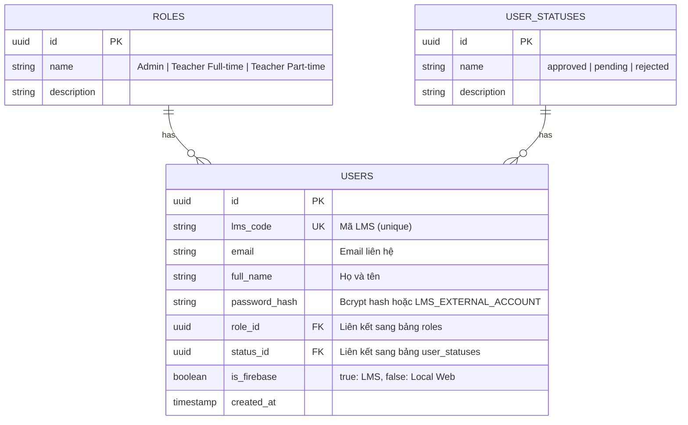
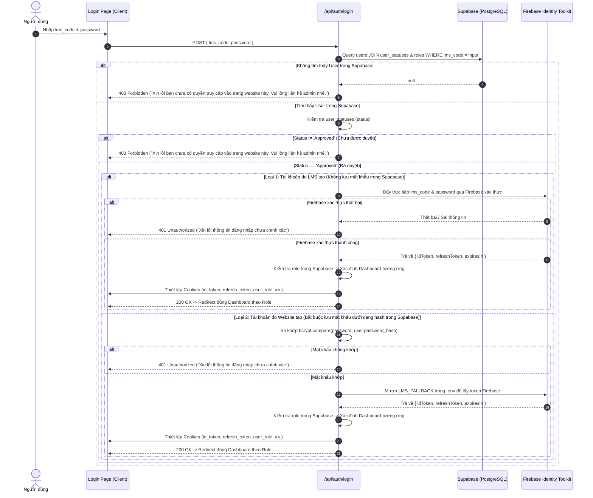
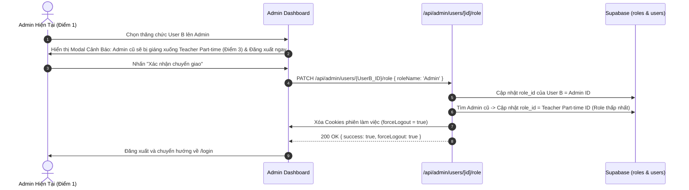
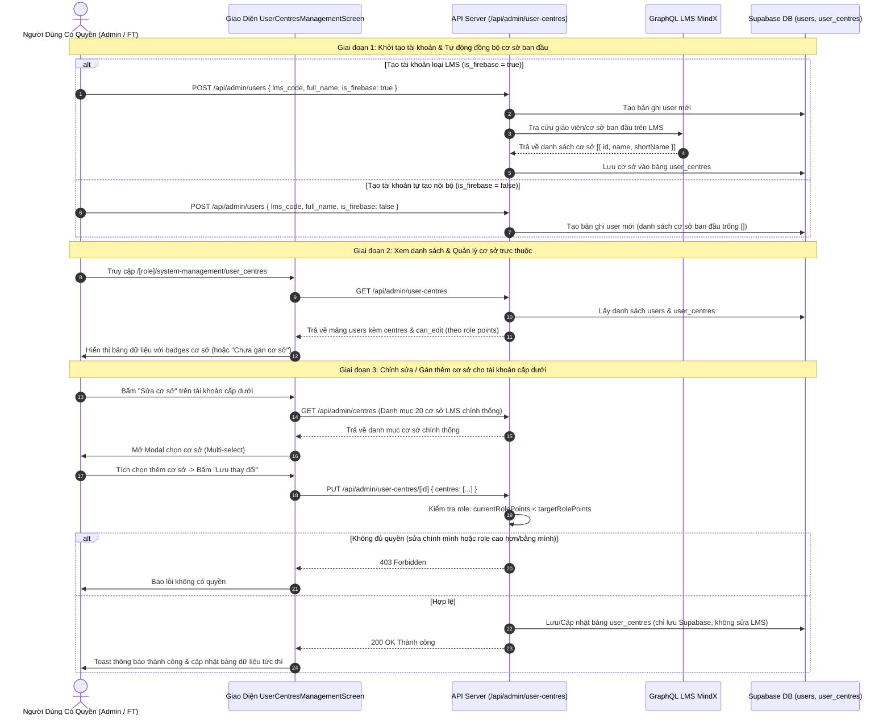
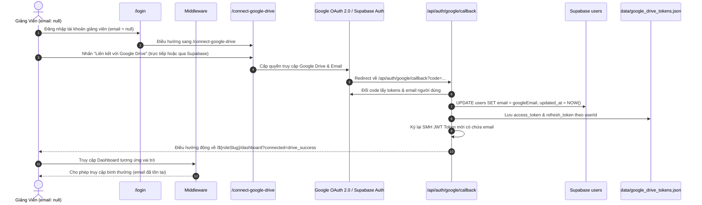
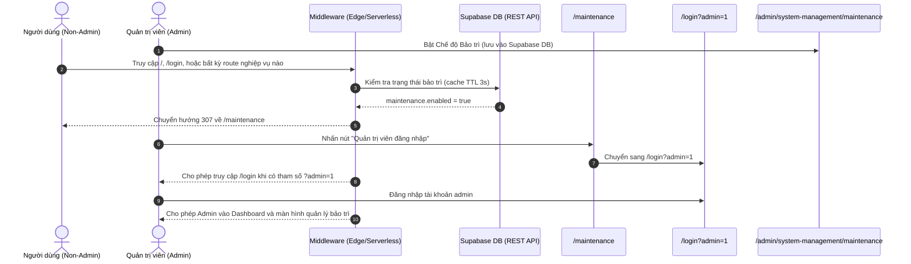

# Tài Liệu Luồng Hoạt Động Của Từng Chức Năng (Feature Flows) - Dự Án SMH

> **QUY TẮC BẮT BUỘC DÀNH CHO AGENT**: 
> Trước khi thực hiện bất kỳ công việc nào (phát triển tính năng, sửa bug, tối ưu UI/UX, thêm API, thay đổi DB), Agent **BẮT BUỘC PHẢI ĐỌC KỸ** tài liệu này để hiểu đúng nghiệp vụ và cấu trúc dữ liệu. 
> Khi có bất kỳ thay đổi nào về luồng hoặc thêm chức năng mới, **BẮT BUỘC CẬP NHẬT** tài liệu này ngay trong cùng commit/task.

---

## Mục Lục
1. [Kiến Trúc Tổng Thể & Mô Hình Dữ Liệu](#1-kiến-trúc-tổng-thể--mô-hình-dữ-liệu)
2. [Luồng Xác Thực & Đăng Nhập (Authentication Flow)](#2-luồng-xác-thực--đăng-nhập-authentication-flow)
3. [Luồng Bảo Vệ Tuyến Đường & Middleware (Route Guarding)](#3-luồng-bảo-vệ-tuyến-đường--middleware-route-guarding)
4. [Luồng Kiểm Tra Phiên & Đăng Xuất (Session & Logout Flow)](#4-luồng-kiểm-tra-phiên--đăng-xuất-session--logout-flow)
5. [Luồng Quản Trị Người Dùng (Admin User Management Flow)](#5-luồng-quản-trị-người-dùng-admin-user-management-flow)
   - [5.1 Lấy danh sách tài khoản](#51-lấy-danh-sách-tài-khoản)
   - [5.2 Tạo tài khoản mới](#52-tạo-tài-khoản-mới)
   - [5.3 Cập nhật trạng thái người dùng (Status Update)](#53-cập-nhật-trạng-thái-người-dùng-status-update)
   - [5.4 Cập nhật vai trò & Chính sách Single Admin (Role Update)](#54-cập-nhật-vai-trò--chính-sách-single-admin-role-update)
   - [5.5 Chỉnh sửa thông tin tài khoản (Edit User)](#55-chỉnh-sửa-thông-tin-tài-khoản-edit-user)
6. [Quy Tắc Quản Trị Trạng Thái & Database Quan Trọng](#6-quy-tắc-quản-trị-trạng-thái--database-quan-trọng)

---

## 1. Kiến Trúc Tổng Thể & Mô Hình Dữ Liệu

Hệ thống **SMH (Student MindX Hub)** kết hợp 2 hệ thống dịch vụ chính:
- **Supabase (PostgreSQL)**: Quản lý thông tin hồ sơ người dùng (`users`), vai trò (`roles`), trạng thái xét duyệt (`user_statuses`).
- **Firebase Auth (LMS MindX)**: Xác thực đăng nhập đối với tài khoản cán bộ/giáo viên đã có trên LMS MindX và cung cấp JWT Token (`id_token`) dùng cho các dịch vụ liên kết.

### Mô hình quan hệ thực thể (ERD):



---

## 2. Luồng Xác Thực & Đăng Nhập (Authentication Flow)

- **Entrypoint UI**: `app/login/page.tsx`
- **Backend API**: `app/api/auth/login/route.ts`
- **Tuyến đường constants**: `lib/constants/api-routes.ts`

### Các bước xử lý chi tiết:

1. **Người dùng nhập thông tin**:
   - Nhập thông tin đăng nhập (`lms_code`) và mật khẩu (`password`) trên giao diện đăng nhập.
2. **Kiểm tra sự tồn tại trong Supabase**:
   - Truy vấn bảng `users` trong Supabase theo `lms_code`.
   - **Nếu KHÔNG tìm thấy**: Phản hồi lỗi `403 Forbidden` với thông báo:  
     *"Xin lỗi bạn chưa có quyền truy cập vào trang website này. Vui lòng liên hệ admin nhé."*
3. **Kiểm tra trạng thái phê duyệt (Status check)**:
   - Nếu tìm thấy người dùng, kiểm tra `status` thông qua liên kết với bảng `user_statuses`.
   - **Nếu trạng thái CHƯA PHẢI `Approved`**: Phản hồi lỗi `403 Forbidden` với thông báo:  
     *"Xin lỗi bạn chưa có quyền truy cập vào trang website này. Vui lòng liên hệ admin nhé."*
4. **Phân loại tài khoản & Xác thực (khi đã được Approved)**:
   - **Trường hợp A - Tài khoản do LMS tạo (có sẵn)**:
     - **Nguyên tắc**: *Tài khoản do LMS tạo không cần lưu mật khẩu trong Supabase*.
     - Đẩy trực tiếp thông tin đăng nhập mà người dùng vừa nhập (`lms_code` và `password`) qua Firebase để xác thực (đẩy trực tiếp `lms_code` và mật khẩu, không cần đuôi email).
     - **Nếu Firebase xác thực thành công**: Nhận Firebase token (`id_token`, `refresh_token`), sau đó kiểm tra `role` của tài khoản này trong Supabase để chuyển hướng qua đúng Dashboard tương ứng (Admin -> `/admin/dashboard`, Teacher Full-time -> `/teacher-fulltime/dashboard`, Teacher Part-time -> `/teacher-parttime/dashboard`).
     - **Nếu Firebase trả sai**: Phản hồi lỗi `401 Unauthorized` với thông báo:  
       *"Xin lỗi thông tin đăng nhập chưa chính xác"*.
   - **Trường hợp B - Tài khoản do Website tạo**:
     - **Nguyên tắc**: *Tài khoản do Website tạo bắt buộc phải lưu mật khẩu dưới dạng hash (`password_hash`) trong Supabase*.
     - Lấy thông tin tài khoản mà người dùng đã nhập, so khớp mật khẩu người dùng nhập với `password_hash` lưu trong Supabase (sử dụng `bcrypt.compare`).
     - **Nếu mật khẩu không khớp**: Phản hồi lỗi `401 Unauthorized` với thông báo:  
       *"Xin lỗi thông tin đăng nhập chưa chính xác"*.
     - **Nếu mật khẩu khớp**: Mượn thông tin `LMS_FALLBACK` lưu trong `.env` (`LMS_FALLBACK_CODE` / `LMS_FALLBACK_PASSWORD`) để gửi yêu cầu lấy token hợp lệ từ Firebase, sau đó kiểm tra `role` của tài khoản trong Supabase và điều hướng qua đúng Dashboard tương ứng của role đó.

### Sơ đồ luồng đăng nhập chi tiết:



---

## 3. Luồng Bảo Vệ Tuyến Đường & Middleware (Route Guarding & Dynamic Permissions)

- **Vị trí file**: `middleware.ts`
- **Mục tiêu**: Kiểm tra phiên đăng nhập và phân quyền truy cập động theo vai trò và ma trận phân quyền màn hình.

### Logic xử lý của Middleware:
1. Đọc cookie `id_token`, `user_role`, và `user_permissions`.
2. Nếu người dùng **đã đăng nhập** và truy cập `/login` -> Tự động chuyển hướng về đúng Dashboard theo vai trò.
3. Nếu người dùng **chưa đăng nhập** và truy cập các tuyến đường được bảo vệ (`/admin/*`, `/teacher-fulltime/*`, `/teacher-parttime/*`, `/profile`, `/dashboard`) -> Tự động chuyển hướng về `/login?redirect=...`.
4. **Kiểm Soát Quyền Truy Cập Động Theo Quyền Thực Tế Của Role (Dynamic RBAC)**:
   - **Tuyến `/admin/dashboard`**: Dashboard chuyên biệt của Quản trị viên, chỉ tài khoản `Admin` mới được phép truy cập. Các vai trò khác bị chuyển hướng về đúng Dashboard của họ.
   - **Tuyến `/admin/users` (Quản lý tài khoản)**: Cho phép truy cập nếu là `Admin` HOẶC vai trò của người dùng được cấp quyền `user_management === true` (từ bảng phân quyền màn hình).
   - **Tuyến `/admin/permissions` (Phân quyền màn hình)**: Cho phép truy cập nếu là `Admin` HOẶC vai trò của người dùng được cấp quyền `screen_permission_management === true`.
   - **Tuyến `/teacher-fulltime/*`**: Cho phép `Admin` hoặc `Teacher Full-time`.
   - **Tuyến `/teacher-parttime/*`**: Cho phép `Admin` hoặc `Teacher Part-time`.

---

## 4. Luồng Kiểm Tra Phiên & Đăng Xuất (Session & Logout Flow)

### 4.1 Kiểm tra thông tin phiên (`/api/auth/me`):
- Kiểm tra cookie `smh_token` hoặc `id_token`. Nếu không có -> trả về `401 { authenticated: false }`.
- Nếu có token -> truy vấn thông tin người dùng từ Supabase Database theo thời gian thực (Real-time) và trả về `{ authenticated: true, user: { id, name, role, permissions } }`.

### 4.2 Đăng xuất (`/api/auth/logout`):
- Được gọi từ component Header User Profile Dropdown (`components/layout/AppLayout.tsx`) hoặc `components/LogoutButton.tsx`.
- Gửi yêu cầu `POST /api/auth/logout`.
- API thực hiện xóa bỏ sạch toàn bộ 7 cookies xác thực và phân quyền: `smh_token`, `id_token`, `refresh_token`, `user_id`, `user_name`, `user_role`, `user_permissions` (set `maxAge: 0` và `expires: Thu, 01 Jan 1970 00:00:00 UTC`).
- Client đồng thời xóa các cookie non-HttpOnly và thực hiện chuyển hướng cứng (`window.location.href = "/login"`) nhằm làm sạch toàn bộ cache bộ nhớ và React State, tránh tình trạng Middleware tự điều hướng ngược vào Dashboard do cookie cũ sót lại.

---

## 5. Luồng Quản Trị Người Dùng (Admin User Management Flow)

- **Entrypoint UI**: `app/admin/users/page.tsx` (Đường dẫn: `/admin/users`)
- **Backend API**: `app/api/admin/users/*` và `app/api/admin/users/check-lms`
- **Hằng số quản lý**: [api-routes.ts](file:///d:/Documents/Practice/Self%20Project/SMH/lib/constants/api-routes.ts) & [roles.ts](file:///d:/Documents/Practice/Self%20Project/SMH/lib/constants/roles.ts)

### 5.1 Hệ Thống Phân Cấp Điểm Vai Trò (Role Points Hierarchy)
- **Nguyên tắc cốt lõi**: **Điểm càng thấp, quyền hạn role càng cao**.
- Bảng phân cấp điểm vai trò:
  | Tên Role | Điểm (Points) | Cấp bậc | Mô tả & Ràng buộc |
  | :--- | :---: | :--- | :--- |
  | **Admin** | **1** | **Cao nhất** | Quản trị viên toàn hệ thống, **duy nhất 1 tài khoản** |
  | **Teacher Full-time** | **2** | Cấp trung | Giáo viên cơ hữu |
  | **Teacher Part-time** | **3** | **Thấp nhất** | Giáo viên bán thời gian / đối tác |

---

### 5.2 Thêm tài khoản mới (Create User Flow)
- **Các trường thông tin**:
  - `lms_code` (Mã LMS / Tên đăng nhập)
  - `password` (Mật khẩu)
  - `full_name` (Họ và tên)
  - `is_firebase` (Loại tài khoản: LMS có sẵn vs Do website tạo)
  - `status_code` (Trạng thái, **mặc định là `approved`**)
  - `role_name` (Vai trò)
- **Xử lý theo từng loại tài khoản**:
  1. **Loại tài khoản: Do LMS có sẵn (`is_firebase = true`)**:
     - Trường `mật khẩu` để ở chế độ **Read-only (Chỉ đọc)** và không lưu mật khẩu trong Supabase.
     - Có nút **"Kiểm tra LMS"** bên cạnh ô nhập `lms_code` (gọi `POST /api/admin/users/check-lms`).
     - Hệ thống kiểm tra xem tài khoản nào đang có `lms_code` này trên LMS MindX (qua GraphQL query `GetTeachers` và Firebase Auth):
       - **Nếu có và tìm thấy họ tên đầy đủ**: Tự động điền họ tên thật người dùng (ví dụ: *"Võ Minh Huân"*) vào trường `họ và tên` và giữ ở chế độ chỉ đọc.
       - **Nếu có mã trên LMS nhưng KHÔNG tìm thấy họ tên**: Hệ thống hiển thị thông báo *"Tìm thấy tài khoản LMS nhưng chưa có họ tên trên hệ thống. Admin có thể tự đặt họ tên bên dưới"* và **mở khóa ô Họ và tên để Admin tự nhập tay** và lưu họ tên này vào Supabase.
       - **Nếu không tồn tại trên LMS**: Hiển thị thông báo:  
         *"Không có tài khoản với mã lms_code này trên hệ thống LMS. Vui lòng kiểm tra lại."*
  2. **Loại tài khoản: Do Website tạo (`is_firebase = false`)**:
     - **Quy tắc bắt buộc kiểm tra LMS trước**: Tài khoản do website tạo là tài khoản **chưa từng có trong LMS trước đó**. Do đó, khi nhập mã LMS, hệ thống (cả frontend và backend) **bắt buộc kiểm tra bên LMS trước**:
       - **Nếu mã LMS ĐÃ TỒN TẠI trên hệ thống LMS**: Báo lỗi ngay lập tức:  
         *⚠️ "Mã LMS này đã tồn tại trên hệ thống LMS MindX ({fullName}). Tài khoản do website tạo không được trùng với LMS có sẵn. Vui lòng chọn loại 'Tài khoản LMS có sẵn' hoặc chọn mã khác."* và ngăn chặn không cho tạo.
       - **Nếu mã LMS CHƯA TỒN TẠI trên LMS (và chưa có trong Supabase)**: Cho phép tiếp tục tạo.
     - Bắt buộc phải nhập đầy đủ tất cả các trường: `lms_code`, `họ và tên`, `mật khẩu`.
     - Mật khẩu được băm an toàn bằng `bcrypt.hash(password, 10)` trước khi lưu vào Supabase.

---

### 5.3 Danh Sách Người Dùng & Phân Quyền Thao Tác (Xem / Sửa / Xóa)
- **Hiển thị**: Cột Vai trò hiển thị kèm Điểm Role: `Admin (Điểm: 1)`, `Teacher Full-time (Điểm: 2)`, `Teacher Part-time (Điểm: 3)`.
- **Quy tắc phân quyền thao tác**:
  - **Xem chi tiết (View)**: Cho phép xem thông tin đối với tất cả các tài khoản.
  - **Chỉnh sửa (Edit)**:
    - **Tài khoản do LMS có sẵn (`is_firebase = true`)**: **Chỉ được quyền xem**, tuyệt đối **không được phép sửa** (nút Sửa hiển thị "Khóa sửa").
    - **Tài khoản do Website tạo (`is_firebase = false`)**: Được quyền chỉnh sửa khi và chỉ khi thỏa mãn một trong hai điều kiện:
      1. **Là tài khoản của chính bản thân mình** (`user.id === currentUserId`).
      2. **Là các tài khoản dưới cấp role của mình** (`targetRolePoints > currentUserRolePoints`, tức điểm vai trò của tài khoản đó lớn hơn điểm của người đang đăng nhập - vì điểm càng thấp vai trò càng cao).
      *(Các trường hợp tài khoản của người khác có role ngang cấp hoặc cao hơn mình sẽ bị hiển thị "Khóa sửa" và backend chặn bằng mã lỗi 403 Forbidden).*
  - **Xóa tài khoản (Delete User Flow)**:
    - Bổ sung nút **"Xóa"** trong danh sách người dùng cho Admin quản trị.
    - **Ràng buộc an toàn**:
      - **Tuyệt đối không được phép xóa tài khoản Admin duy nhất** (nút Xóa bị khóa / disabled đối với Admin).
      - Không được phép tự xóa tài khoản của chính mình khi đang đăng nhập.
    - **Quy trình xóa**:
      1. Khi bấm nút "Xóa", hiển thị **Modal Xác Nhận Xóa Tài Khoản** nêu rõ tên người dùng, mã LMS, vai trò và cảnh báo hành động không thể hoàn tác.
      2. Khi Admin bấm "Xác nhận xóa": Gửi yêu cầu `DELETE /api/admin/users/[id]`.
      3. Backend xóa bản ghi khỏi bảng `users` trong Supabase DB và trả về phản hồi thành công (kèm dữ liệu chữ của vai trò).
      4. Giao diện tự động cập nhật lại danh sách người dùng.

---

### 5.4 Quy Tắc Single Admin & Chuyển Giao Quyền Quản Trị (Transfer Admin Policy)
- **Ràng buộc cốt lõi**:
  - **Hệ thống chỉ duy nhất có 1 người giữ vai trò Admin** (Điểm vai trò: 1).
  - Mọi sự thay đổi làm mất đi người có role Admin hiện tại (chuyển giao vai trò Admin cho tài khoản khác) **bắt buộc phải có người thay thế** và **phải có sự xác nhận từ Admin hiện tại** (qua Popup xác nhận chuyển giao).
- **Quy trình khi Admin hiện tại đồng ý chuyển giao quyền**:
  1. Tài khoản được chỉ định nhận quyền Admin mới sẽ được gán `role_id` của Admin.
  2. Tài khoản Admin cũ sẽ **tự động bị giáng chức thành cấp role thấp nhất là `Teacher Part-time` (Điểm vai trò: 3)**.
  3. Hệ thống xóa toàn bộ cookie phiên (`id_token`, `refresh_token`, `user_role`, v.v.) của Admin cũ (`forceLogout = true`) và **buộc đăng xuất ngay lập tức**.

---

### 5.5 Sơ đồ tuần tự: Chuyển giao quyền Admin



---

## 6. Luồng Phân Quyền Màn Hình Theo Vai Trò (Screen Permissions By Role Flow)

### 6.1 Cấu Trúc Menu Hệ Thống (Phân cấp Menu chính & Menu phụ)
- **Bảng dữ liệu**: `menus` và `role_menu_permissions` trong Supabase.
- **Cấu trúc hiện tại**:
  - **Menu chính (Parent Menu)**:
    - `Quản lý hệ thống` (`system_management`)
  - **Các Menu phụ (Sub-menus / Child Tabs)**:
    - `Quản lý tài khoản` (`user_management`, đường dẫn: `/admin/dashboard`)
    - `Quản lý phân quyền màn hình` (`screen_permission_management`, đường dẫn: `/admin/permissions`)

### 6.2 Ma Trận Phân Quyền & Giao Diện Toggle Switch
- Bảng phân quyền hiển thị trực quan:
  - Cột 1: Danh sách Menu dạng cây phân cấp (Menu chính có nhãn nổi bật, các Menu phụ thụt lề kèm nhánh kết nối trực quan, có thể nhấp chuột trực tiếp vào tên hoặc đường dẫn để chuyển nhanh đến màn hình chức năng đó).
  - Các cột tiếp theo: Tương ứng với từng Vai trò (`Admin: Điểm 1`, `Teacher Full-time: Điểm 2`, `Teacher Part-time: Điểm 3`).
  - Mỗi ô giao điểm là một **Nút Toggle Switch**:
    - `BẬT (True / Màu đỏ Ruby)`: Vai trò đó được phép nhìn thấy và truy cập màn hình.
    - `TẮT (False / Màu xám)`: Vai trò đó bị ẩn và không có quyền truy cập màn hình.

### 6.3 Quy Tắc Phân Cấp Vai Trò Khi Phân Quyền (Chỉ Phân Quyền Cho Cấp Dưới)
- **Nguyên tắc cốt lõi**: **Không được tự update cho chính role hiện tại và những role cao hơn mình, chỉ được phân quyền cho các role nhỏ hơn mình**.
  - Áp dụng hệ thống Điểm Role: `Admin (Điểm: 1)` > `Teacher Full-time (Điểm: 2)` > `Teacher Part-time (Điểm: 3)`.
  - Nếu tài khoản mục tiêu có `targetRolePoints <= currentUserRolePoints` (bằng hoặc cao hơn cấp bậc người đang thao tác):
    - Trên giao diện: Tiêu đề cột hiển thị huy hiệu ổ khóa `🔒 (Khóa sửa)`, các nút Toggle Switch bị khóa tương tác (`disabled`, `opacity-40`, `grayscale`).
    - Trên Backend (`PUT /api/admin/permissions`): Chặn bằng mã lỗi `403 Forbidden` kèm thông báo: *"Bạn không thể tự cập nhật phân quyền cho chính vai trò của mình hoặc các vai trò có cấp bậc cao hơn. Bạn chỉ được phép phân quyền cho các vai trò cấp dưới."*
  - Chỉ khi `targetRolePoints > currentUserRolePoints` (vai trò cấp dưới) thì mới được phép bật/tắt quyền.

### 6.4 Quy Tắc Logic Cascade Chi Phối (Parent - Child Toggle Logic)
1. **Khi TẮT Menu chính của một Role**:
   - Tất cả các Menu phụ trực thuộc Menu chính đó **tự động bị tắt (is_enabled = false)**.
   - Trên giao diện, toàn bộ các nút toggle của menu phụ bên dưới trong cột vai trò đó sẽ **lập tức bị làm mờ (opacity-30, grayscale)** và khóa tương tác (disabled) cho đến khi Menu chính được bật lại.
2. **Khi BẬT Menu chính của một Role**:
   - Tất cả các Menu phụ trực thuộc Menu chính đó sẽ **tự động được bật sáng lên hết (is_enabled = true)**.
   - Khi Menu chính đang BẬT: Người có quyền được **tùy ý tắt hoặc bật riêng lẻ 1 vài menu phụ** nếu muốn mà không làm ảnh hưởng đến trạng thái bật của Menu chính.
3. **Khi BẬT một Menu phụ**:
   - Nếu Menu chính của role đó đang ở trạng thái tắt, hệ thống sẽ **tự động bật Menu chính** để đảm bảo tính toàn vẹn của điều hướng.

### 6.5 Tương Tác Menu Hệ Thống (Interactive Sidebar Accordion & Clickable Links)
- **Menu Sidebar (`AppLayout`)**: Tiêu đề Menu Chính ("QUẢN LÝ HỆ THỐNG") hoạt động như một khối Accordion có thể bấm vào để đóng/mở danh sách menu con, kèm icon mũi tên chuyển hướng mượt mà. Các đường dẫn menu con ("Quản lý tài khoản", "Phân quyền màn hình") kích hoạt điều hướng ngay lập tức.
- **Bảng Phân Quyền**: Tên và đường dẫn của các menu con trong bảng ma trận là các liên kết động có thể nhấp chuột trực tiếp để mở nhanh màn hình chức năng.

### 6.6 Sơ Đồ Tuần Tự: Cập Nhật Phân Quyền Màn Hình

```mermaid
sequenceDiagram
    autonumber
    actor Admin as Quản Trị Viên
    participant UI as Screen Permissions Page (/admin/permissions)
    participant API as /api/admin/permissions
    participant DB as Supabase (menus & role_menu_permissions)

    Admin->>UI: Toggle Menu chính hoặc Menu phụ của Role X
    UI->>UI: Cập nhật Optimistic UI (Cascade: Tắt Menu chính -> Mờ và tắt hết Menu phụ; Bật Menu chính -> Bật hết Menu phụ)
    UI->>API: PUT /api/admin/permissions { role_name, menu_code, is_enabled }
    API->>API: Áp dụng Cascade Logic trên Backend
    API->>DB: Upsert role_menu_permissions (role_id, menu_id, is_enabled)
    API-->>UI: 200 OK { success: true, permissions: { ... } }
    UI->>Admin: Hiển thị thông báo cập nhật thành công
```

---

## 7. Quy Chuẩn Giao Diện Tổng Thể & Hồ Sơ Cá Nhân (Global Layout, Theme & Profile Flow)

### 7.1 Kiến Trúc Layout Thống Nhất (`AppLayout`)
Toàn bộ hệ thống quản trị sử dụng chung component bố cục `AppLayout` với chuẩn responsive cao cấp:
1. **Sidebar Bên Trái (Cố định & Phân Cấp)**:
   - Logo thương hiệu SMH (biểu tượng khiên phát quang màu đỏ Ruby).
   - Phân nhóm menu theo cấu hình hệ thống:
     - Nhóm **QUẢN LÝ HỆ THỐNG**:
       - 👥 **Quản lý tài khoản** (`/admin/dashboard`).
       - 🛡️ **Phân quyền màn hình** (`/admin/permissions`).
   - Hiệu ứng nhận diện mục đang hoạt động (Active tab): Nền kính đỏ Ruby (`bg-rose-50 dark:bg-rose-950/40`), chữ nổi bật (`text-rose-600 dark:text-rose-400`), viền chỉ thị đỏ Ruby.
   - **Responsive**: Tự động co dãn trên Desktop và chuyển thành **Drawer trượt cảm ứng** kèm nút Hamburger (`Menu`) và nút đóng (`X`) trên màn hình Mobile/Tablet.

2. **Header Tối Giản Phía Trên**:
   - Bên trái: Nút Hamburger trên Mobile + Breadcrumbs dẫn đường (ví dụ: *Quản lý hệ thống > Quản lý tài khoản*).
   - Bên phải:
     - **Nút Chuyển Đổi Theme Sáng / Tối (☀️ / 🌙)**: Chuyển đổi mượt mà giữa Dark mode và Light mode, lưu tùy chọn vào `localStorage`.
     - **Cụm Thông Tin Người Dùng**: Avatar chữ cái đầu, Họ và tên, Badge Vai trò chuẩn màu.
     - **User Profile Dropdown**: Khi bấm vào cụm User sẽ bung Dropdown menu kính mờ với các tính năng:
       + 👤 **Chỉnh sửa thông tin cá nhân** (chuyển hướng tới `/profile`).
       + 🚪 **Đăng xuất khỏi hệ thống** (gọi API `/api/auth/logout` và chuyển hướng an toàn về `/login`).

### 7.2 Bảng Màu Chủ Đạo Đỏ - Đen - Trắng (Ruby - Obsidian - Pure White)
- **Tông Đỏ (Accent Crimson/Ruby)**: Sắc thái Ruby Velvet (`#E11D48`), Rose-Red (`#F43F5E`), Deep Wine (`#881337`), ánh sáng phát quang nhẹ (`shadow-rose-600/30`), viền bán trong suốt (`border-rose-500/20`), tuyệt đối không dùng màu đỏ cờ thô cứng (`#FF0000`).
- **Tông Đen (Dark Mode - Obsidian/Slate)**: Nền sâu Obsidian (`#090D16`), Card bề mặt kính (`#0B0F17` / `#111827`), viền mảnh thanh lịch (`border-slate-800/80`).
- **Tông Trắng (Light Mode - Crisp Snow/Slate)**: Nền tuyết thanh thoát (`#F8FAFC`), Card màu tuyết (`#FFFFFF`), đổ bóng mềm mượt (`shadow-sm border border-slate-200`).

### 7.3 Quy Chuẩn Icon Framework
- **100% sử dụng icon chính thống từ thư viện `lucide-react`** (`ShieldCheck`, `Users`, `KeyRound`, `Sun`, `Moon`, `UserCheck`, `LogOut`, v.v.).
- Tuyệt đối nghiêm cấm việc dùng icon tự chế/AI tự vẽ lung tung.

### 7.4 Trang Hồ Sơ Cá Nhân (`/profile` & API `/api/profile`)
- **Hiển thị (Identity Card)**:
  - Thẻ căn cước số thể hiện: Avatar cỡ lớn, Họ và tên, Mã LMS (cố định), Email (cố định), Nguồn tài khoản (*Tài khoản LMS* hoặc *Do website tạo*), Vai trò, Trạng thái phê duyệt, Ngày tạo tài khoản.
- **Chỉnh sửa thông tin**:
  - Cho phép sửa Họ và tên hiển thị.
  - Cho phép Đổi mật khẩu mới (chỉ áp dụng đối với tài khoản do website tạo, có kiểm tra xác nhận mật khẩu và độ dài tối thiểu 6 ký tự). Tài khoản LMS có sẵn sẽ bị khóa tính năng đổi mật khẩu tại đây.

---

## 8. Luồng Trang Not-Found (404) Tự Điều Hướng Thông Minh

### 8.1 Nguyên Tắc Hoạt Động
Khi người dùng truy cập vào bất kỳ đường dẫn nào không tồn tại hoặc không hợp lệ:
1. Hệ thống Next.js render trang lỗi chuyên biệt [app/not-found.tsx](file:///d:/Documents/Practice/Self%20Project/SMH/app/not-found.tsx).
2. Giao diện hiển thị đồ họa số `404` nổi bật theo phong cách Obsidian & Ruby Red kèm thông báo giải thích rõ ràng.
3. **Bộ đếm ngược thông minh 5 giây (Countdown Timer)**:
   - Hệ thống tự động truy vấn endpoint `/api/auth/me` để xác định trạng thái đăng nhập và vai trò của người dùng hiện tại:
     + **Nếu đã đăng nhập**: Tự động điều hướng về đúng Dashboard theo vai trò của người dùng:
       * **`Admin`**: Tự động chuyển hướng về `/admin/dashboard`.
       * **`Teacher Full-time`**: Tự động chuyển hướng về `/teacher-fulltime/dashboard`.
       * **`Teacher Part-time`**: Tự động chuyển hướng về `/teacher-parttime/dashboard`.
     + **Nếu chưa đăng nhập (Khách vãng lai)**: Tự động điều hướng về **Trang chủ (`/`)**.
   - Có thanh tiến trình (Progress Bar) co dần theo thời gian thực từ 100% về 0% trong 5 giây.
4. **Hành động tức thì**:
   - Nếu đã đăng nhập: Người dùng có thể bấm nút *"Về Dashboard ngay"* để quay lại trang làm việc mà không cần chờ hết 5 giây, hoặc bấm *"Về Trang chủ"*.
   - Nếu chưa đăng nhập: Người dùng có thể bấm *"Về Trang chủ ngay"* hoặc bấm *"Đăng nhập"*.

---

## 9. Quy Tắc Quản Trị Trạng Thái & Database Quan Trọng

1. **Không Hardcode UUID**:
   Mọi thao tác truy vấn hay cập nhật trạng thái (`status_id`) hoặc vai trò (`role_id`) đều phải truy vấn bảng danh mục tương ứng (`user_statuses`, `roles`) để lấy ID động.
2. **Quản lý Điểm Role (Role Points)**:
   Luôn tuân thủ quy tắc: **Điểm càng thấp, quyền hạn role càng cao** (`Admin: 1`, `Teacher Full-time: 2`, `Teacher Part-time: 3`).
3. **API Routes tập trung**:
   Mọi endpoint gọi fetch từ client phải sử dụng hằng số trong [api-routes.ts](file:///d:/Documents/Practice/Self%20Project/SMH/lib/constants/api-routes.ts).
4. **Tính nhất quán khi phát triển**:
   Bất kỳ ai (kể cả AI Agent) khi chỉnh sửa tính năng cũ hoặc thêm tính năng mới phải đọc lại tài liệu này và cập nhật lại sơ đồ/nội dung nếu có sự thay đổi.
5. **Tra Cứu & Sử Dụng Schema GraphQL LMS Firebase**:
   Khi lấy bất kỳ dữ liệu gì từ hệ thống LMS / Firebase, bắt buộc phải tra cứu từ tài liệu schema [docs/LMS_GRAPHQL_SCHEMA.md](file:///d:/Documents/Practice/Self%20Project/SMH/docs/LMS_GRAPHQL_SCHEMA.md) và file [docs/lms_graphql_schema.json](file:///d:/Documents/Practice/Self%20Project/SMH/docs/lms_graphql_schema.json) để tìm đúng bộ query và trường dữ liệu tương ứng.
6. **Định Dạng Dữ Liệu Trả Về Từ API (Chỉ Dạng Chữ, Không Trả Về Khóa Ngoại)**:
   Tất cả API backend xây dựng trong dự án khi trả về client bắt buộc phải trả về dữ liệu dưới dạng **CHỮ (Text / Display Name)** cho các trường tham chiếu/khóa ngoại (`role`, `status`, `centre`, `department`, `city`, v.v.), **tuyệt đối không trả về ID khóa ngoại thô**. Ngoại lệ duy nhất được phép là **ID khóa chính (Primary Key)** của chính đối tượng đó.
7. **Quy Chuẩn UI & Bảng Màu Thống Nhất**:
   Mọi màn hình phát triển mới bắt buộc kế thừa `AppLayout` (Sidebar trái + Header User Dropdown), dùng bảng màu Đỏ Ruby - Đen Obsidian - Trắng tuyết và 100% icon từ `lucide-react`.
8. **Quy Chuẩn Căn Giữa Dữ Liệu & Chống Từ Mồ Côi**:
   - Tất cả các cột mang tính định danh/trạng thái (STT, Mã LMS, Loại tài khoản, Trạng thái, Vai trò, Thao tác, Toggle switch) bắt buộc phải được căn giữa (`text-center`, `justify-center`).
   - Áp dụng `whitespace-nowrap` cho toàn bộ nhãn, huy hiệu, tiêu đề cột và nút thao tác để chống triệt để tình trạng từ mồ côi (xuống dòng chỉ 1 từ). Các thông tin cùng khối dữ liệu phải giữ trên cùng 1 hàng, kết hợp thanh cuộn ngang `overflow-x-auto` để đảm bảo hiển thị hoàn hảo trên Mobile và mọi kích cỡ màn hình.
9. **Cơ Chế Real-Time Khi Có Nút Làm Mới**:
   - Đối với bất kỳ màn hình nào đã trang bị nút "Làm mới" / "Cập nhật" (như Màn hình Quản lý tài khoản, Phân quyền màn hình): **Tuyệt đối không chạy polling tự động ngầm (`setInterval`)**, dữ liệu chỉ tải lại khi người dùng bấm nút làm mới hoặc sau khi hoàn tất hành động thêm/sửa/xóa/toggle.
   - Đối với dữ liệu định danh người dùng (Họ tên, Vai trò): Luôn truy vấn trực tiếp từ Supabase Database theo thời gian thực (Real-time).
10. **Quy Chuẩn Bảng Điều Khiển Theo Vai Trò (Role Dashboards Standard)**:
    - **Admin Dashboard (`/admin/dashboard`)**: Trang tổng quan điều hành của Quản trị viên, gồm Banner Ruby-Obsidian, Card *Tổng số tài khoản* (lấy trực tiếp từ Supabase DB) và Card *Tổng lượt truy cập*, kèm phím tắt điều hướng nhanh tới *Quản lý tài khoản* (`/admin/system-management/users`) và *Phân quyền màn hình* (`/admin/system-management/screen_permission`).
    - **Teacher Full-time Dashboard (`/teacher-fulltime/dashboard`)**: Trang tổng quan dành cho Giáo viên cơ hữu, gồm Banner đào tạo và Card *Tổng lượt truy cập*.
    - **Teacher Part-time Dashboard (`/teacher-parttime/dashboard`)**: Trang tổng quan dành cho Giáo viên thỉnh giảng, gồm Banner ca dạy và 4 Cards chỉ số (*Tổng số lớp học*, *Tổng số học viên*, *Tổng số bài nộp*, *Tổng lượt truy cập*).
11. **Quy Tắc Biến Môi Trường (Chỉ Duy Nhất 1 File `.env`)**:
    - Toàn bộ biến môi trường của dự án chỉ được lưu trữ trong **DUY NHẤT một file `.env`**.
    - Tuyệt đối cấm tạo các file biến thể khác (như `.env.example`, `.env.local`, `.env.production`, v.v.).
    - File `.env` được bảo vệ tuyệt đối trong `.gitignore` để không bao giờ bị lộ lên GitHub.
12. **Quy Chuẩn Định Tuyến Phân Quyền Theo Vai Trò (`/[role]/[main_menu]/[menu]`)**:
    - Tất cả các tuyến đường có khả năng phân quyền bắt buộc có định dạng: `/[role]/[main_menu]/[menu]`.
    - Tuyến màn hình phân quyền bắt buộc có tên chứa `screen_permission`: `/[role]/system-management/screen_permission`.
    - **Chặn Truy Cập Chéo Vai Trò & Chặn Không Có Quyền**: Nếu người dùng thuộc vai trò A cố truy cập route của vai trò B hoặc truy cập menu mà chưa được cấp quyền, Middleware sẽ chặn ngay lập tức và **trả về trực tiếp trang 404 (`not-found`)**.
13. **Quy Chuẩn Layout Toàn Diện (Header, Footer Có Trạng Thái Hệ Thống & Sidebar Thu Gọn)**:
    - Mọi giao diện (Dashboard, Quản lý, Phân quyền, Đăng nhập, 404) đều sở hữu Header và Footer thống nhất mang nhận diện thương hiệu *Student MindX Hub (SMH)*.
    - Huy hiệu "Trạng thái hệ thống hoạt động ổn định 100% • Supabase DB Connected" được đặt cố định ở Footer, loại bỏ card trùng lặp trong nội dung chính của Dashboard.
    - Sidebar hỗ trợ thu gọn (Collapse) thành dải icon 80px hoặc mở rộng 288px, ghi nhớ trạng thái qua `localStorage`.
14. **Phân Định Dữ Liệu & Thao Tác Theo Cấp Bậc Vai Trò (Role Hierarchy Scope)**:
    - Áp dụng triệt để nguyên tắc Role Points: Người dùng chỉ được xem/thao tác các tài khoản và phân quyền cho các vai trò cấp dưới mình (`targetRolePoints > currentUserRolePoints`).
    - Khóa toàn bộ các thao tác chỉnh sửa, đổi vai trò, đổi trạng thái và xóa đối với chính tài khoản của mình và các vai trò có cấp bậc bằng hoặc cao hơn mình.
15. **Quy Tắc Quản Lý Cơ Sở Trực Thuộc (Affiliated Centres Rule)**:
    - **Lưu trữ độc lập trên Supabase**: Bảng `user_centres` lưu trữ danh sách các cơ sở được gán cho từng người dùng, không can thiệp hay thay đổi dữ liệu của LMS MindX.
    - **Khởi tạo tự động theo loại tài khoản**:
      - Tài khoản loại LMS (`is_firebase = true`): Tự động truy vấn cơ sở từ LMS và đồng bộ sang Supabase khi tạo tài khoản hoặc đăng nhập.
      - Tài khoản tự tạo nội bộ (`is_firebase = false`): Ban đầu không có cơ sở trực thuộc (`[]`).
    - **Phân cấp chỉnh sửa**: Role cao hơn (`currentUserPoints < targetUserPoints`) mới được phép xem và chỉnh sửa cơ sở cho role thấp hơn. Khóa chỉnh sửa đối với chính mình và các tài khoản bằng hoặc cao hơn.
    - **Danh mục cơ sở chọn thêm**: Luôn lấy từ danh mục chính thống trên hệ thống MindX LMS.

---

## 10. Luồng Quản Lý Cơ Sở Trực Thuộc Của Các Tài Khoản (User Affiliated Centres Flow)



---

## 11. Luồng Quản Lý & Hiển Thị Lịch Trải Nghiệm (Trial / Office Hours Flow)

### 11.1 Nguyên Tắc Nghiệp Vụ & Quy Chuẩn Kiến Trúc
1. **Menu Chính**: `Kiểm tra dữ liệu` (`data_inspection`).
2. **Menu Phụ**: `Lịch trải nghiệm` (`trial_schedules`).
3. **Quy Chuẩn Định Tuyến**: `/[role]/data-inspection/trial_schedules`.
4. **Bắt Buộc Kế Thừa AppLayout Toàn Diện**:
   - Giao diện lịch trải nghiệm bắt buộc được bọc trong `<AppLayout pageTitle="Lịch Trải Nghiệm (Office Hours)">`.
   - Có đầy đủ Sidebar điều hướng bên trái, Header thông tin người dùng / theme toggle / dropdown hồ sơ và Footer tình trạng hệ thống ở cuối trang.
5. **Cơ Chế Lọc Theo Cơ Sở Trực Thuộc**:
   - Dữ liệu truy vấn hoàn toàn phụ thuộc vào danh sách cơ sở trực thuộc của chính tài khoản đang đăng nhập được lưu trong bảng `user_centres` (kèm cơ chế lưu trữ bền vững `data/user_centres_store.json`).
   - Hệ thống tự động trích xuất `user_id` từ session cookie, truy vấn danh sách `centre_id`, và truyền vào `centreIn` của GraphQL query LMS MindX.
   - **Tuyệt đối không có bất kỳ bộ lọc chọn tài khoản hay role nào trên giao diện**, đảm bảo tính bảo mật và đúng phạm vi phụ trách của từng người dùng.
6. **Truy Vấn GraphQL Chuẩn & Lọc Thô Triệt Để**:
   - Tên Query: `GetApprovedOfficeHours($payload: OfficeHourQuery)`.
   - Tham số: `paginationType: "OFFSET"`, `pageIndex: 0`, `itemsPerPage: 500`, `statusIn: ["APPROVED"]`, `timeFrom`, `timeTo`.
   - Lọc thô (Cleaning Rules): Tự động loại bỏ 100% các ca có trường `type` liên quan đến dạy bù: `MAKEUP`, `MAKE_UP`, `BÙ`, `BU` (loại bỏ dấu tiếng Việt, không phân biệt hoa thường).
   - Dữ liệu schema mở rộng: `courses`, `courseLines`, `studentCount`, `managerNote`, `note`, `teacher`, `centre`, `appointments`.
7. **Chuẩn Hóa Dữ Liệu 3 Cấp**:
   - **Cơ sở (Campus)**: Chuẩn hóa theo tên cơ sở trực thuộc của user:
     * `tên lửa` / `ten lua` $\rightarrow$ **`TÊN LỬA`**
     * `lũy bán bích` / `luy ban bich` $\rightarrow$ **`LŨY BÁN BÍCH`**
     * `tây thạnh` / `tay thanh` $\rightarrow$ **`TÂY THẠNH`**
     * `trường chinh` / `truong chinh` $\rightarrow$ **`TRƯỜNG CHINH`**
     * Cơ sở khác: Viết hoa theo tên cơ sở.
   - **Khối môn (Khoi)**: Dựa vào `courseLines` và `courses`:
     * Có `XART`, `ART`, `DRAW`, `VISUAL` $\rightarrow$ **`ART`** (Màu Xanh Navy `#1E3A8A`)
     * Có `ROB`, `ROBOT`, `ROBOTICS` $\rightarrow$ **`ROBOTICS`** (Màu Xanh Lá `#15803D`)
     * Còn lại $\rightarrow$ **`CODING`** (Màu Đỏ Ruby `#E11D48`)
     * **Thứ tự ưu tiên hiển thị chuẩn mockup**: `CODING` $\rightarrow$ `ART` $\rightarrow$ `ROBOTICS`.
   - **Ca học (Shift - UTC+7)**:
     * Giờ $\le$ 12:00 $\rightarrow$ **`SÁNG`** (09:00 - 12:00 hoặc thời gian thực tế).
     * 12:01 $\le$ Giờ < 17:00 $\rightarrow$ **`CHIỀU`** (14:00 - 17:00 hoặc thời gian thực tế).
     * Giờ $\ge$ 17:01 $\rightarrow$ **`TỐI`** (18:00 - 21:00 hoặc thời gian thực tế).
     * Trong mỗi ô ca: Sắp xếp tăng dần theo `startTime`.
8. **Bố Cục Bảng Ma Trận Duy Nhất (Single Matrix View)**:
   - Cấu trúc bảng ma trận gồm 7 cột chuẩn theo đúng thứ tự:
     `[Cơ sở]` (gộp dòng toàn cơ sở) | `[Khối]` (gộp dòng theo khối) | `[Ca]` | `[Khung giờ]` | `[Mentor]` (kèm nhãn Xác nhận / Cần xác nhận) | `[Số lượng]` | `[Note]`.
   - **1 case = 1 dòng duy nhất**: Chỉ hiển thị thông tin Mentor và Số lượng học viên của case đó, không tách chi tiết từng dòng ứng viên/học sinh.
   - **Tiêu đề bảng tinh gọn & Triệt tiêu thanh cuộn**: Tiêu đề bảng chỉ hiển thị `LỊCH TRẢI NGHIỆM ([Tên cơ sở]) • [Ngày]`, tuyệt đối không có chữ "LMS MindX Hub" hay "Ultra HD 3x". Toàn bộ thanh cuộn ngang/dọc được ẩn triệt để (`no-scrollbar`).
   - **Định dạng chữ to, rõ ràng và tương phản cao (High-Legibility Standard)**: Cỡ chữ trong bảng và khi kết xuất ảnh sao chép (cả 1 cơ sở và toàn bộ cơ sở) phải to, rõ nét (`text-base`, `text-lg`, `font-black`), tương phản cao để khi xem ảnh thu nhỏ trên Zalo (điện thoại/máy tính) vẫn đọc rõ thông tin không bị mờ hay nhỏ.
   - Màu sắc phân biệt trực quan:
     * Khối CODING: Đỏ Ruby (`#E11D48`).
     * Khối ART: Xanh Navy (`#1E3A8A`).
     * Khối ROBOTICS: Xanh Lá (`#15803D`).
     * Hàng có Mentor xác nhận: Nền xanh nhạt `#DCEBFC`.
     * Hàng cần xác nhận Mentor: Nền đỏ hồng nhạt `#FFE2E5`.
9. **Tính Năng Sao Chép Ảnh Lịch Theo Từng Cơ Sở & Toàn Bộ Cơ Sở Gửi Nhanh Zalo**:
   - Dưới mỗi tên cơ sở có nút **"Sao chép ảnh"** (kèm icon `Copy`).
   - **Ràng buộc quan trọng**: Chỉ hiển thị nút sao chép ảnh đối với các cơ sở có ca trải nghiệm (`hasCases === true`). Cơ sở không có ca học thì không có nút này. Nút sao chép toàn bộ cơ sở được đặt trên thanh công cụ trên cùng.
   - Kết xuất ảnh không chứa bất kỳ thanh cuộn nào.
   - Nút "Sao chép ảnh" có class `hide-on-export` nên sẽ tự động ẩn đi trong ảnh thành phẩm.
   - Ghi trực tiếp định dạng ảnh PNG vào Clipboard của hệ điều hành thông qua API `navigator.clipboard.write([new ClipboardItem({ 'image/png': blob })])`.
   - Người dùng chỉ cần mở nhóm Zalo và nhấn **Ctrl + V** để dán ảnh lịch cơ sở cực nét ngay tức thì.

```mermaid
sequenceDiagram
    autonumber
    actor User as Người Dùng (Admin / Giáo Viên)
    participant UI as Màn Hình Lịch Trải Nghiệm (TrialSchedulesScreen)
    participant API as API Server (/api/office-hours)
    participant SB as Supabase DB & Store (user_centres)
    participant LMS as MindX LMS GraphQL (GetApprovedOfficeHours)
    participant Clip as Clipboard Hệ Điều Hành

    User->>UI: Truy cập /[role]/data-inspection/trial_schedules
    Note over UI: Kế thừa AppLayout (Sidebar, Header, Footer) & Mặc định chọn ngày mai
    UI->>API: GET /api/office-hours?date=YYYY-MM-DD
    API->>SB: Lấy danh sách cơ sở trực thuộc của userId đang đăng nhập
    SB-->>API: Danh sách 4 cơ sở (TÊN LỬA, TÂY THẠNH, LŨY BÁN BÍCH, TRƯỜNG CHINH)
    API->>LMS: query GetApprovedOfficeHours { centreIn: [...ids], timeFrom, timeTo, statusIn: ["APPROVED"] }
    LMS-->>API: Trả về danh sách ca trải nghiệm thô
    API->>API: Lọc thô loại bỏ 100% ca chứa Makeup / Bù
    API-->>UI: Trả về { success: true, date, userCentres, officeHours }
    UI->>UI: Phân loại: Cơ sở -> Khối (CODING -> ART -> ROBOTICS) -> Ca (SÁNG -> CHIỀU -> TỐI)
    UI->>User: Hiển thị bảng ma trận từng cơ sở với cột "Số lượng học viên" (1 case = 1 dòng)
    
    opt Sao chép ảnh cơ sở có case gửi Zalo
        User->>UI: Bấm "Sao chép ảnh" dưới tên cơ sở có ca trải nghiệm
        UI->>Clip: Kết xuất ảnh cơ sở bằng html-to-image (pixelRatio: 2.5, ẩn nút chép) & ghi ClipboardItem
        UI->>User: Toast "Đã sao chép ảnh lịch cơ sở! Hãy mở Zalo và nhấn Ctrl+V để gửi ngay"
    end

    opt Sao chép ảnh toàn bộ cơ sở gửi Zalo
        User->>UI: Bấm "Sao chép toàn bộ cơ sở" trên thanh công cụ
        UI->>Clip: Kết xuất ảnh tổng thể từ export container riêng biệt kèm Banner tổng thể & ghi ClipboardItem
        UI->>User: Toast "Đã sao chép toàn bộ lịch trải nghiệm! Hãy mở Zalo và nhấn Ctrl+V để gửi ngay"
    end

---

## 12. Luồng Bảo Mật JWT & Tùy Chỉnh Duy Trì Phiên Đăng Nhập (JWT Security & Session Expiration Flow)

### 12.1 Quy Chuẩn Token & Biến Môi Trường
1. **Secret Key**: `JWT_SECRET=student-mindx-hub` được đặt duy nhất tại `.env`.
2. **Ký Token**: Sử dụng thư viện `jose` (chuẩn Web Crypto API, tương thích cả Edge Runtime và Node.js API), thuật toán `HS256`.
3. **Payload Token (`SmhJwtPayload`)**:
   - `userId`: UUID người dùng trong Supabase.
   - `lmsCode`: Mã định danh LMS.
   - `name`: Tên đầy đủ người dùng.
   - `role`: Tên vai trò (chữ).
   - `status`: Trạng thái người dùng (chữ).
   - `expiryDays`: Số ngày duy trì phiên đăng nhập (cố định 30 ngày).
4. **Thời Hạn Duy Trì Phiên Cố Định**:
   - **Thời gian cố định**: 30 ngày (`30d`).
   - Token định danh `smh_token` và các cookie người dùng (`user_id`, `user_name`, `user_role`) được cấp thời hạn sống `maxAge = 30 * 24 * 60 * 60 = 2,592,000` giây.

### 12.2 Cơ Chế Kiểm Tra Hết Hạn & Đẩy Về Đăng Nhập
1. **Tại Middleware (`middleware.ts`)**:
   - Middleware đọc cookie `smh_token` trên mọi request tới các tuyến đường được bảo vệ (`/admin/*`, `/teacher-fulltime/*`, `/teacher-parttime/*`, `/profile`, `/dashboard`).
   - Giải mã và kiểm tra hạn sử dụng qua `verifySmhToken`.
   - **Khi token hết hạn (`expired === true`)**:
     * Middleware xóa toàn bộ cookie xác thực (`smh_token`, `id_token`, `refresh_token`, `user_id`, `user_name`, `user_role`, `user_permissions`).
     * Tự động chuyển hướng người dùng về trang đăng nhập với thông số: `/login?redirect=[targetPath]&reason=expired`.

### 12.3 Chuẩn Gợi Ý Đăng Nhập & Chống Tự Động Điền Trên Form (`/login`)
1. **Gợi ý tài khoản đã lưu (Browser Autofill Suggestions)**:
   - Input định danh sử dụng chuẩn `name="username"`, `id="username"`, `autoComplete="username"`.
   - Input mật khẩu sử dụng chuẩn `name="password"`, `id="password"`, `autoComplete="current-password"`.
2. **Cơ chế chống tự điền ban đầu (Anti-Initial-Autofill)**:
   - Các trường nhập liệu được gắn cờ `readOnly` trong khoảnh khắc tải trang ban đầu để ngăn chặn trình duyệt tự động điền đè dữ liệu lên giao diện.
   - Khi người dùng nhấp chuột hoặc chạm vào ô nhập liệu (`onFocus`, `onMouseDown`, `onTouchStart`), thuộc tính `readOnly` tự động được gỡ bỏ, kích hoạt ngay lập tức menu gợi ý các tài khoản đã lưu trên trình duyệt để chọn đăng nhập nhanh.

### 12.4 Quy Chuẩn Quản Lý & Chỉnh Sửa Thông Tin Cá Nhân (`/profile`)
1. **Phân biệt Nguồn tài khoản chuẩn xác**:
   - Hệ thống căn cứ vào `password_hash === 'LMS_EXTERNAL_ACCOUNT'`:
     * Nếu đúng -> Xác định là **Tài khoản LMS** (`is_firebase = true`, icon ngọn lửa tím).
     * Nếu không -> Xác định là **Do website tạo** (`is_firebase = false`, icon xanh lá).
2. **Quy tắc chỉnh sửa Họ và tên (`full_name`)**:
   - **Tài khoản LMS**:
     * Nếu hệ thống LMS MindX đã có thông tin họ tên (`lmsResult.fullName` có giá trị): Khóa cố định 100% (`disabled` / read-only), không cho phép chỉnh sửa, hiển thị huy hiệu `(Cố định từ LMS)`.
     * Nếu tài khoản LMS nhưng chưa có thông tin họ tên trên LMS: Cho phép người dùng tự cập nhật họ tên vào hệ thống (ràng buộc 2 - 70 ký tự).
   - **Tài khoản do website tạo**: Luôn được quyền chỉnh sửa họ và tên tự do (ràng buộc 2 - 70 ký tự).
3. **Quy tắc Mã LMS (`lms_code`) & Email**:
   - Khóa cố định 100% (`disabled` / read-only) cho mọi tài khoản, tuyệt đối không được chỉnh sửa.
4. **Quy tắc Đổi mật khẩu**:
   - **Mật khẩu chỉ được thay đổi khi là tài khoản do website cấp** (tài khoản nội bộ, ràng buộc 6 - 50 ký tự, có đo độ mạnh trực quan và kiểm tra trùng khớp xác nhận).
### 12.5 Badge Nổi Hiển Thị Lượt Truy Cập Trang Web (`FloatingVisitBadge`)
1. **Kiến trúc & Vị trí hiển thị**:
   - Được gắn ở tầng gốc ứng dụng `app/layout.tsx` (bên trong `ThemeProvider`), tự động hiển thị nổi trên toàn bộ các trang (Trang chủ, Đăng nhập, Dashboard các vai trò, Profile, Quản lý, v.v.).
   - Vị trí nổi cố định: `fixed top-[72px] right-3 sm:top-[76px] sm:right-6 z-40`. Vị trí này hoàn toàn tách biệt ngoài thanh Header (chiều cao 64px) để không che khuất cụm nút ThemeToggle và Avatar Dropdown.
2. **Hiệu ứng trực quan**:
   - **Chấm xanh nhấp nháy (Pulsing Green Dot)**: Sử dụng kỹ thuật Tailwind `relative flex h-2 w-2` với vòng xung nhịp ngoài `animate-ping bg-emerald-400 opacity-75` và nhân trong `bg-emerald-500` tạo cảm giác hệ thống đang trực tiếp hoạt động (live).
   - **Thiết kế Glassmorphism**: Nền trắng mờ / đen mờ `bg-white/90 dark:bg-[#0B0F17]/90 backdrop-blur-md`, bo tròn con nhộng (`rounded-full`), viền mờ tinh tế, đổ bóng nhẹ nhàng và phóng nhẹ khi di chuột (`hover:scale-105`).
3. **Cơ chế dữ liệu**:
   - Lấy dữ liệu lượt truy cập toàn trang (`total_visits_global`) từ API `/api/dashboard/stats`.
   - Kết hợp đọc/ghi tệp lưu trữ bền vững `data/site_stats.json` để bảo toàn số lượt truy cập qua các lần khởi động lại server.

---

## 13. Danh Mục Bộ Tài Khoản Kiểm Thử Chuẩn (Official Test Accounts)

Khi thực hiện kiểm thử tự động (Subagent, Browser tests, API tests), Agent **bắt buộc sử dụng đúng danh mục tài khoản sau, tuyệt đối không nhập linh tinh**:

| Vai trò | Tài khoản (Mã LMS) | Mật khẩu | Phạm vi cơ sở trực thuộc | Đặc điểm |
| :--- | :--- | :--- | :--- | :--- |
| **Admin** | `admin` | `Nh@t@nh12@8` | Toàn bộ 101 cơ sở LMS MindX | Toàn quyền quản trị, phân quyền, xem lịch tất cả cơ sở |
| **Teacher Full-time** | `anhhn01` | `Nh@t@nh12@8` | 4 cơ sở (Tên Lửa, Tây Thạnh, Lũy Bán Bích, Trường Chinh) | Quyền giảng viên full-time theo cơ sở trực thuộc |
| **Teacher Part-time** | `huynhnhatanh` | `Nh@t@nh12@8` | 4 cơ sở (Tên Lửa, Tây Thạnh, Lũy Bán Bích, Trường Chinh) | Quyền giảng viên part-time theo cơ sở trực thuộc |

---

## 14. Luồng Thông Báo Triển Khai Qua Telegram (Post-Build Telegram Notification Flow)

### 14.1 Nguyên Tắc Hoạt Động
Do gói Vercel Hobby (Free) không hỗ trợ Webhook gửi ra ngoài, hệ thống chuyển sang giải pháp thực thi kịch bản thông báo tự động ngay sau khi lệnh build thành công:
1. **Lệnh thực thi trong `package.json`**:
   `"build": "next build && node telegram-notify.js"`
2. **Kịch bản thông báo**: [telegram-notify.js](file:///d:/Documents/Practice/Self%20Project/SMH/telegram-notify.js) đặt tại thư mục gốc của dự án.
3. **Trích xuất thông tin môi trường tự động từ Vercel**:
   - `VERCEL_PROJECT_NAME`: Tên dự án Vercel.
   - `VERCEL_PROJECT_PRODUCTION_URL`: URL phiên bản Production chính thức.
   - `VERCEL_URL`: URL bản build Preview chi tiết.
   - `deployTime`: Thời gian hoàn thành theo múi giờ Việt Nam (`Asia/Ho_Chi_Minh`).
4. **Gửi tin nhắn qua Telegram Bot API**:
   - Gọi API Telegram: `https://api.telegram.org/bot${token}/sendMessage`.
   - Đọc cấu hình bảo mật `TELEGRAM_BOT_TOKEN` và `TELEGRAM_CHAT_ID` từ biến môi trường.
   - Định dạng tin nhắn HTML trực quan, vô hiệu hóa xem trước link (`disable_web_page_preview: true`).

---

## 15. Luồng Chế Độ Bảo Trì Hệ Thống (Maintenance Mode Flow)

### 15.1 Nguyên Tắc Vận Hành
1. **Phạm vi kiểm soát & Màn hình bảo trì xuất hiện đầu tiên**:
   - Chỉ tài khoản Quản trị viên (Admin) mới có quyền truy cập màn hình cấu hình tại `/[role]/system-management/maintenance` và gọi API `POST /api/admin/maintenance`.
   - **Màn hình bảo trì xuất hiện đầu tiên và cố định liên tục**: Khi bảo trì được bật (`isEnabled = true`), toàn bộ người dùng (kể cả khách vãng lai truy cập Trang chủ `/` hay truy cập `/login` thông thường) đều bị Middleware chuyển hướng ngay lập tức về trang `/maintenance` và lưu lại ở đó liên tục cho đến khi bảo trì kết thúc. Tuyệt đối không chỉ hiển thị một thông báo rồi cho ở lại trang khác.
   - **Kênh đăng nhập đặc thù cho Quản trị viên**: Trên trang `/maintenance`, có nút "Quản trị viên đăng nhập" dẫn đến `/login?admin=1`. Chỉ đường dẫn này mới cho phép mở form đăng nhập để Admin xác thực. Nếu tài khoản không phải Admin (như Teacher) cố tình đăng nhập trong thời gian này, API `/api/auth/login` sẽ từ chối với mã lỗi 503 và giao diện tự động điều hướng người dùng quay trở lại ngay màn hình `/maintenance`.
2. **Thời gian dự kiến tự động (3 tiếng mặc định)**:
   - Form cho phép Admin chọn ngày giờ kết thúc mong muốn (`datetime-local`).
   - Nếu Admin không nhập ngày giờ hoặc để trống, hệ thống **tự động thiết lập thời gian hoàn tất là 3 tiếng kể từ thời điểm kích hoạt**.
   - Hỗ trợ các nút chọn nhanh: Mặc định (+3 tiếng), +1 tiếng, +6 tiếng, +12 tiếng.
   - Khi thời gian dự kiến trôi qua (`Date.now() >= endTimestamp`), hệ thống tự động nhận diện bảo trì đã kết thúc và mở lại quyền truy cập bình thường.
3. **Cách ly môi trường 100% (Local vs Production)**:
   - Dữ liệu trạng thái được lưu trữ cục bộ tại `data/maintenance_status.json` (được bảo vệ trong `.gitignore` không đẩy lên Git).
   - Việc kích hoạt bảo trì tại máy nội bộ (Local) hoàn toàn không làm gián đoạn hay ảnh hưởng đến máy chủ Production trên Vercel.

```mermaid
sequenceDiagram
    autonumber
    actor User as Người dùng (Guest / Teacher)
    actor Admin as Quản Trị Viên (Admin)
    participant MW as Next.js Middleware
    participant Page as Màn Hình /maintenance
    participant Login as Màn Hình /login?admin=1
    participant AdminUI as Màn hình Bảo Trì Admin
    participant Svc as Maintenance Service
    participant JSON as data/maintenance_status.json

    Admin->>AdminUI: Bật toggle bảo trì & (tùy chọn) chọn giờ kết thúc
    AdminUI->>Svc: POST /api/admin/maintenance { isEnabled: true, expectedEndTime }
    Note over Svc: Nếu không điền giờ: Mặc định = Now + 3 giờ
    Svc->>JSON: Ghi trạng thái bảo trì & môi trường
    Svc-->>AdminUI: Phản hồi thành công

    User->>MW: Truy cập route bất kỳ (/, /login, /dashboard, /teacher-fulltime/...)
    MW->>Svc: Kiểm tra trạng thái bảo trì
    alt Người dùng đã xác thực là Admin
        MW-->>Admin: Cho phép truy cập bình thường
    else Người dùng là vai trò khác / khách
        MW-->>User: Redirect 307 về /maintenance (Hiện lên đầu tiên và lưu lại liên tục)
        User->>Page: Xem đồng hồ đếm ngược & thông điệp bảo trì
        opt Admin cần đăng nhập quản trị
            Admin->>Page: Nhấp nút "Quản trị viên đăng nhập"
            Page->>Login: Điều hướng sang /login?admin=1
            Login->>Admin: Nhập thông tin tài khoản admin và đăng nhập thành công
        end
    end
```

---

## 16. Luồng Quản Lý Phiên Bản Hệ Thống & Cập Nhật Khi Đẩy Git (Single Version Changelog & Git Push Flow)

### 16.1 Nguyên Tắc Hiển Thị Duy Nhất 1 Phiên Bản Mới Nhất
1. **Nguồn chân lý duy nhất (Single Source of Truth)**:
   - Toàn bộ thông tin phiên bản được định nghĩa tập trung tại `lib/constants/version.ts` qua hằng số `CURRENT_VERSION`.
   - Bao gồm: Số hiệu (`version`), Ngày phát hành (`releaseDate`), Tiêu đề (`title`), Tóm tắt ngắn gọn (`summary`), và danh sách các chức năng chính (`features`).
2. **Trang Nhật Ký Phát Hành (`/changelog`)**:
   - **Chỉ hiển thị DUY NHẤT 1 phiên bản mới nhất**, tuyệt đối không hiển thị danh sách lịch sử dài dòng.
   - Các tính năng được phân loại rõ ràng bằng nhãn trực quan: *Tính Năng Mới*, *Cải Tiến*, *Bảo Mật & Ổn Định*.
   - Nội dung tóm tắt hướng tới người dùng cuối, ngắn gọn, súc tích, dễ hiểu và không dùng ngôn từ kỹ thuật quá chuyên môn.
3. **Chân trang (SystemFooter)**:
   - Hiển thị trực tiếp số hiệu phiên bản mới nhất (ví dụ: `Phiên bản v1.5`) liên kết trực tiếp tới `/changelog`.
   - Loại bỏ chữ `production` và loại bỏ huy hiệu trạng thái hệ thống trùng lặp.
4. **Quy Tắc Bắt Buộc Khi Đẩy Code Lên Git**:
   - Mỗi khi có tính năng/chức năng mới được chuẩn bị đẩy lên nhánh Git (`git push origin preview`), Agent **BẮT BUỘC** phải:
     1. Tăng số hiệu phiên bản theo định dạng `vx.x` (ví dụ `v1.5` -> `v1.6`).
     2. Cập nhật ngày phát hành và bổ sung tóm tắt tính năng mới vào `lib/constants/version.ts`.
     3. Tiến hành kiểm tra `npm run build` trước khi `git add .` và `git push`.

---

## 17. Luồng Điều Hướng Trang Chủ & Phân Biệt Sidebar Bảng Điều Khiển (Home & Dashboard Isolation Flow)

### 17.1 Cơ Chế Ẩn/Hiện Menu Sidebar Giữa Trang Chủ Và Dashboard
1. **Khi đang ở Trang chủ (`/`)**:
   - Giao diện kế thừa `AppLayout` với Sidebar thu gọn và Header Dropdown đồng nhất.
   - **Cách ly menu hoàn toàn**: Toàn bộ các nhóm menu nghiệp vụ của Dashboard (*QUẢN LÝ HỆ THỐNG*, *KIỂM TRA DỮ LIỆU*, v.v.) đều bị ẩn đi.
   - Sidebar chỉ hiển thị **DUY NHẤT một nút "Về Bảng điều khiển"** (`/[role]/dashboard`).
2. **Khi ở Dashboard hoặc các màn hình quản lý (`pathname !== "/"` )**:
   - Sidebar hiển thị đầy đủ các nhóm menu nghiệp vụ theo phân quyền vai trò.
   - Nhóm *TỔNG QUAN* có nút **"Xem trang chủ"** (`/`) để chuyển nhanh ra Trang chủ và nút **"Bảng điều khiển"** (`/[role]/dashboard`).

### 17.2 Quy Chuẩn Vị Trí Badge Lượt Truy Cập & Nhận Diện Thương Hiệu Logo
1. **Badge Nổi Lượt Truy Cập**:
   - Neo cố định tại `fixed bottom-16 right-3 sm:bottom-20 sm:right-6 z-40`, đảm bảo bay lơ lửng an toàn phía trên Chân trang (Footer), tuyệt đối không che khuất thông tin bản quyền và phiên bản hệ thống.
2. **Logo SMH**:
   - Loại bỏ huy hiệu `Hub` gắn cạnh chữ `SMH` trong component `SMHLogo`, vì chữ `H` trong `SMH` vốn dĩ đã là `Hub`.
3. **Thanh Cuộn Sleek Custom Scrollbar**:
   - Không sử dụng thanh cuộn mặc định thô cứng của hệ điều hành.
   - Áp dụng thanh cuộn tinh gọn (width 7px, bo tròn pill `rounded-full`, track trong suốt, thumb màu trung tính mờ nhẹ, hiệu ứng chuyển màu Crimson/Ruby khi rê chuột, hỗ trợ đầy đủ cả chế độ Sáng và Tối).

---

## 18. Luồng Bắt Buộc Liên Kết Google Drive Cho Giảng Viên (Mandatory Google Drive OAuth Flow)

### 18.1 Mục Đích & Điều Kiện Kích Hoạt
1. **Đối tượng áp dụng**: Tài khoản có vai trò Giảng viên (`Teacher Part-time` hoặc `Teacher Full-time`).
2. **Điều kiện kích hoạt**: Thuộc tính `email` trong bảng `users` tại cơ sở dữ liệu Supabase đang để trống (`NULL` hoặc rỗng `""`).
3. **Hành vi cưỡng chế (Strict Enforcement)**:
   - Khi tài khoản đăng nhập thành công qua `/api/auth/login`, hệ thống phát hiện email trống và trả về `requires_google_drive: true` kèm `redirect_url: "/connect-google-drive"`.
   - Tại tầng **Middleware (`middleware.ts`)**: Mọi yêu cầu truy cập đến bất kỳ route nào (Dashboard, Trang chủ, Quản lý...) từ tài khoản này đều bị tự động chặn lại và chuyển hướng (Redirect 307) về màn hình `/connect-google-drive`.
   - Các ngoại lệ duy nhất được phép đi qua: `/connect-google-drive`, `/api/auth/google/*`, `/api/auth/logout`, `/login`, tài nguyên tĩnh `/_next` và favicon.
4. **Hỗ trợ 2 phương thức xác thực linh hoạt**:
   - **Google OAuth 2.0 trực tiếp**: Sử dụng `GOOGLE_CLIENT_ID` và `GOOGLE_CLIENT_SECRET` trong file `.env`.
   - **Supabase Auth OAuth**: Sử dụng `supabase.auth.signInWithOAuth({ provider: 'google' })` khi dự án đã cấu hình Google Provider trên Supabase Dashboard.

### 18.2 Chi Tiết Luồng Tương Tác Google OAuth


### 18.3 Cấu Hình Biến Môi Trường (DUY NHẤT trong `.env`)
```env
GOOGLE_CLIENT_ID=
GOOGLE_CLIENT_SECRET=
GOOGLE_REDIRECT_URI=http://localhost:3000/api/auth/google/callback
```

---

## 19. Luồng Chế Độ Bảo Trì Đa Môi Trường & Bố Cục Thống Nhất (Production Persistent Maintenance Flow & Unified Layout)

### 19.1 Lưu Trữ Bền Vững Đa Môi Trường
1. **Lưu trữ trên Supabase Database**:
   - Bảng `system_settings` (hoặc fallback bản ghi hệ thống `__system_maintenance__` trong bảng `users`) lưu trữ trường `key: "maintenance"`, `enabled: boolean`, `expected_end_time: string`.
   - Giải quyết triệt để vấn đề vô trạng thái (stateless) của môi trường serverless (Vercel Production), nơi hệ thống tệp cục bộ (`fs`) không được lưu giữ giữa các instance lambda.
2. **Bộ đệm thông minh (Smart Caching)**:
   - Caching in-memory với TTL 3 giây tại cả tầng `maintenance-service.ts` và tầng `middleware.ts`.
   - Giảm thiểu số lượng request tới database nhưng đảm bảo phản ứng gần như tức thì khi Admin kích hoạt hoặc tắt bảo trì.
3. **Cơ chế tự động hết hạn (Auto-expiry)**:
   - Khi thời gian hiện tại vượt quá `expectedEndTime`, hệ thống tự động xác định trạng thái bảo trì đã kết thúc mà không cần thao tác tắt thủ công từ Admin.

### 19.2 Cơ Chế Chặn Toàn Diện Tại Middleware


### 19.3 Quy Chuẩn Thống Nhất Giao Diện & Loại Bỏ Văn Bản Giải Thích
1. **Thẻ Tiêu Đề Đồng Nhất (Unified Page Header Card)**:
   - Áp dụng trên 100% màn hình chức năng: Quản lý người dùng, Phân quyền màn hình, Cơ sở trực thuộc, Lịch trải nghiệm, Bảo trì hệ thống, Hồ sơ cá nhân.
   - Bố cục: Thẻ viền tinh tế bo góc lớn `rounded-3xl`, icon đại diện `w-12 h-12 rounded-2xl bg-rose-500/10 text-rose-600 border border-rose-500/20`, tiêu đề in hoa đậm `font-black tracking-wide`, phụ đề súc tích 1 dòng, và các nút tác vụ (Làm mới, Thêm mới) ở góc phải.
2. **Triệt tiêu văn bản giải thích hướng dẫn (Zero Explanatory Text)**:
   - Loại bỏ toàn bộ các khối chú thích dài dòng ("Tại sao cần...", "Lưu ý...", "👉 Vuốt ngang...") để giữ giao diện tối giản, tập trung vào thao tác nghiệp vụ.


