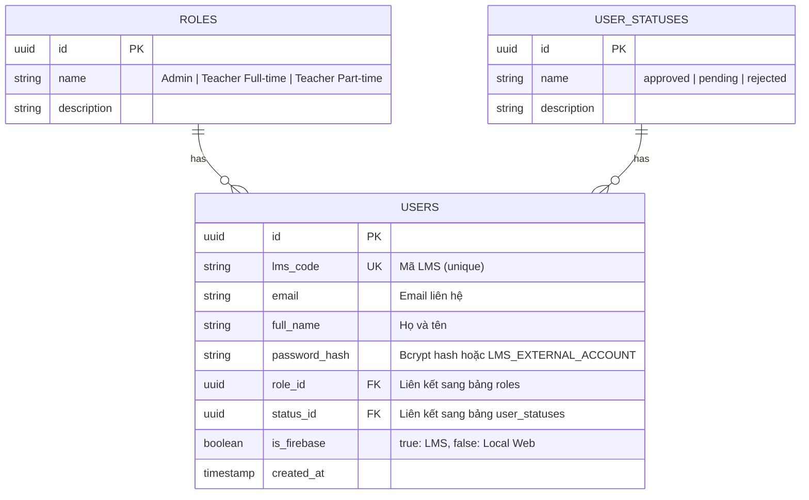
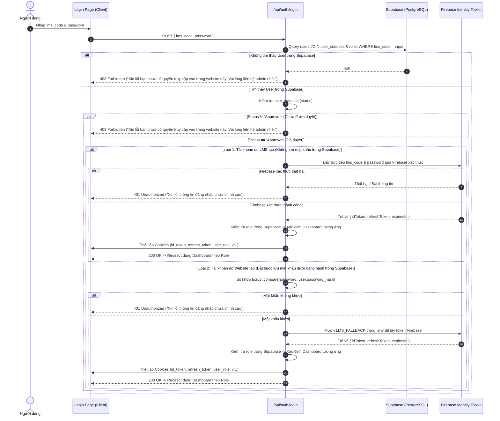
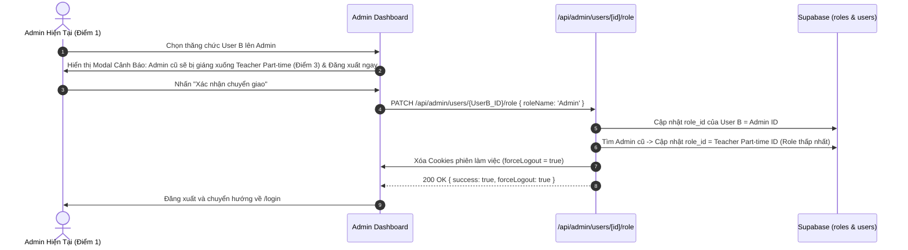

# Tài Liệu Luồng Hoạt Động Của Từng Chức Năng (Feature Flows) - Dự Án SMH

> **QUY TẮC BẮT BUỘC DÀNH CHO AGENT**: 
> Trước khi thực hiện bất kỳ công việc nào (phát triển tính năng, sửa bug, tối ưu UI/UX, thêm API, thay đổi DB), Agent **BẮT BUỘC PHẢI ĐỌC KỸ** tài liệu này để hiểu đúng nghiệp vụ và cấu trúc dữ liệu. 
> Khi có bất kỳ thay đổi nào về luồng hoặc thêm chức năng mới, **BẮT BUỘC CẬP NHẬT** tài liệu này ngay trong cùng commit/task.

---

## Mục Lục
1. [Kiến Trúc Tổng Thể & Mô Hình Dữ Liệu](#1-kiến-trúc-tổng-thể--mô-hình-dữ-liệu)
2. [Luồng Xác Thực & Đăng Nhập (Authentication Flow)](#2-luồng-xác-thực--đăng-nhập-authentication-flow)
3. [Luồng Bảo Vệ Tuyến Đường & Middleware (Route Guarding)](#3-luồng-bảo-vệ-tuyến-đường--middleware-route-guarding)
4. [Luồng Kiểm Tra Phiên & Đăng Xuất (Session & Logout Flow)](#4-luồng-kiểm-tra-phiên--đăng-xuất-session--logout-flow)
5. [Luồng Quản Trị Người Dùng (Admin User Management Flow)](#5-luồng-quản-trị-người-dùng-admin-user-management-flow)
   - [5.1 Lấy danh sách tài khoản](#51-lấy-danh-sách-tài-khoản)
   - [5.2 Tạo tài khoản mới](#52-tạo-tài-khoản-mới)
   - [5.3 Cập nhật trạng thái người dùng (Status Update)](#53-cập-nhật-trạng-thái-người-dùng-status-update)
   - [5.4 Cập nhật vai trò & Chính sách Single Admin (Role Update)](#54-cập-nhật-vai-trò--chính-sách-single-admin-role-update)
   - [5.5 Chỉnh sửa thông tin tài khoản (Edit User)](#55-chỉnh-sửa-thông-tin-tài-khoản-edit-user)
6. [Quy Tắc Quản Trị Trạng Thái & Database Quan Trọng](#6-quy-tắc-quản-trị-trạng-thái--database-quan-trọng)

---

## 1. Kiến Trúc Tổng Thể & Mô Hình Dữ Liệu

Hệ thống **SMH (Student MindX Hub)** kết hợp 2 hệ thống dịch vụ chính:
- **Supabase (PostgreSQL)**: Quản lý thông tin hồ sơ người dùng (`users`), vai trò (`roles`), trạng thái xét duyệt (`user_statuses`).
- **Firebase Auth (LMS MindX)**: Xác thực đăng nhập đối với tài khoản cán bộ/giáo viên đã có trên LMS MindX và cung cấp JWT Token (`id_token`) dùng cho các dịch vụ liên kết.

### Mô hình quan hệ thực thể (ERD):



---

## 2. Luồng Xác Thực & Đăng Nhập (Authentication Flow)

- **Entrypoint UI**: `app/login/page.tsx`
- **Backend API**: `app/api/auth/login/route.ts`
- **Tuyến đường constants**: `lib/constants/api-routes.ts`

### Các bước xử lý chi tiết:

1. **Người dùng nhập thông tin**:
   - Nhập thông tin đăng nhập (`lms_code`) và mật khẩu (`password`) trên giao diện đăng nhập.
2. **Kiểm tra sự tồn tại trong Supabase**:
   - Truy vấn bảng `users` trong Supabase theo `lms_code`.
   - **Nếu KHÔNG tìm thấy**: Phản hồi lỗi `403 Forbidden` với thông báo:  
     *"Xin lỗi bạn chưa có quyền truy cập vào trang website này. Vui lòng liên hệ admin nhé."*
3. **Kiểm tra trạng thái phê duyệt (Status check)**:
   - Nếu tìm thấy người dùng, kiểm tra `status` thông qua liên kết với bảng `user_statuses`.
   - **Nếu trạng thái CHƯA PHẢI `Approved`**: Phản hồi lỗi `403 Forbidden` với thông báo:  
     *"Xin lỗi bạn chưa có quyền truy cập vào trang website này. Vui lòng liên hệ admin nhé."*
4. **Phân loại tài khoản & Xác thực (khi đã được Approved)**:
   - **Trường hợp A - Tài khoản do LMS tạo (có sẵn)**:
     - **Nguyên tắc**: *Tài khoản do LMS tạo không cần lưu mật khẩu trong Supabase*.
     - Đẩy trực tiếp thông tin đăng nhập mà người dùng vừa nhập (`lms_code` và `password`) qua Firebase để xác thực (đẩy trực tiếp `lms_code` và mật khẩu, không cần đuôi email).
     - **Nếu Firebase xác thực thành công**: Nhận Firebase token (`id_token`, `refresh_token`), sau đó kiểm tra `role` của tài khoản này trong Supabase để chuyển hướng qua đúng Dashboard tương ứng (Admin -> `/admin/dashboard`, Teacher Full-time -> `/teacher-fulltime/dashboard`, Teacher Part-time -> `/teacher-parttime/dashboard`).
     - **Nếu Firebase trả sai**: Phản hồi lỗi `401 Unauthorized` với thông báo:  
       *"Xin lỗi thông tin đăng nhập chưa chính xác"*.
   - **Trường hợp B - Tài khoản do Website tạo**:
     - **Nguyên tắc**: *Tài khoản do Website tạo bắt buộc phải lưu mật khẩu dưới dạng hash (`password_hash`) trong Supabase*.
     - Lấy thông tin tài khoản mà người dùng đã nhập, so khớp mật khẩu người dùng nhập với `password_hash` lưu trong Supabase (sử dụng `bcrypt.compare`).
     - **Nếu mật khẩu không khớp**: Phản hồi lỗi `401 Unauthorized` với thông báo:  
       *"Xin lỗi thông tin đăng nhập chưa chính xác"*.
     - **Nếu mật khẩu khớp**: Mượn thông tin `LMS_FALLBACK` lưu trong `.env` (`LMS_FALLBACK_CODE` / `LMS_FALLBACK_PASSWORD`) để gửi yêu cầu lấy token hợp lệ từ Firebase, sau đó kiểm tra `role` của tài khoản trong Supabase và điều hướng qua đúng Dashboard tương ứng của role đó.

### Sơ đồ luồng đăng nhập chi tiết:



---

## 3. Luồng Bảo Vệ Tuyến Đường & Middleware (Route Guarding & Dynamic Permissions)

- **Vị trí file**: `middleware.ts`
- **Mục tiêu**: Kiểm tra phiên đăng nhập và phân quyền truy cập động theo vai trò và ma trận phân quyền màn hình.

### Logic xử lý của Middleware:
1. Đọc cookie `id_token`, `user_role`, và `user_permissions`.
2. Nếu người dùng **đã đăng nhập** và truy cập `/login` -> Tự động chuyển hướng về đúng Dashboard theo vai trò.
3. Nếu người dùng **chưa đăng nhập** và truy cập các tuyến đường được bảo vệ (`/admin/*`, `/teacher-fulltime/*`, `/teacher-parttime/*`, `/profile`, `/dashboard`) -> Tự động chuyển hướng về `/login?redirect=...`.
4. **Kiểm Soát Quyền Truy Cập Động Theo Quyền Thực Tế Của Role (Dynamic RBAC)**:
   - **Tuyến `/admin/dashboard`**: Dashboard chuyên biệt của Quản trị viên, chỉ tài khoản `Admin` mới được phép truy cập. Các vai trò khác bị chuyển hướng về đúng Dashboard của họ.
   - **Tuyến `/admin/users` (Quản lý tài khoản)**: Cho phép truy cập nếu là `Admin` HOẶC vai trò của người dùng được cấp quyền `user_management === true` (từ bảng phân quyền màn hình).
   - **Tuyến `/admin/permissions` (Phân quyền màn hình)**: Cho phép truy cập nếu là `Admin` HOẶC vai trò của người dùng được cấp quyền `screen_permission_management === true`.
   - **Tuyến `/teacher-fulltime/*`**: Cho phép `Admin` hoặc `Teacher Full-time`.
   - **Tuyến `/teacher-parttime/*`**: Cho phép `Admin` hoặc `Teacher Part-time`.

---

## 4. Luồng Kiểm Tra Phiên & Đăng Xuất (Session & Logout Flow)

### 4.1 Kiểm tra thông tin phiên (`/api/auth/me`):
- Kiểm tra cookie `id_token`. Nếu không có -> trả về `401 { authenticated: false }`.
- Nếu có token -> giải mã `user_name` từ cookie và trả về `{ authenticated: true, user: { name } }`.

### 4.2 Đăng xuất (`/api/auth/logout`):
- Gọi từ component `components/LogoutButton.tsx`.
- Gửi yêu cầu `POST /api/auth/logout`.
- API thực hiện xóa bỏ các cookies: `id_token`, `refresh_token`, `user_name`, `user_role`, `user_id`.
- Client chuyển hướng về `/login`.

---

## 5. Luồng Quản Trị Người Dùng (Admin User Management Flow)

- **Entrypoint UI**: `app/admin/users/page.tsx` (Đường dẫn: `/admin/users`)
- **Backend API**: `app/api/admin/users/*` và `app/api/admin/users/check-lms`
- **Hằng số quản lý**: [api-routes.ts](file:///d:/Documents/Practice/Self%20Project/SMH/lib/constants/api-routes.ts) & [roles.ts](file:///d:/Documents/Practice/Self%20Project/SMH/lib/constants/roles.ts)

### 5.1 Hệ Thống Phân Cấp Điểm Vai Trò (Role Points Hierarchy)
- **Nguyên tắc cốt lõi**: **Điểm càng thấp, quyền hạn role càng cao**.
- Bảng phân cấp điểm vai trò:
  | Tên Role | Điểm (Points) | Cấp bậc | Mô tả & Ràng buộc |
  | :--- | :---: | :--- | :--- |
  | **Admin** | **1** | **Cao nhất** | Quản trị viên toàn hệ thống, **duy nhất 1 tài khoản** |
  | **Teacher Full-time** | **2** | Cấp trung | Giáo viên cơ hữu |
  | **Teacher Part-time** | **3** | **Thấp nhất** | Giáo viên bán thời gian / đối tác |

---

### 5.2 Thêm tài khoản mới (Create User Flow)
- **Các trường thông tin**:
  - `lms_code` (Mã LMS / Tên đăng nhập)
  - `password` (Mật khẩu)
  - `full_name` (Họ và tên)
  - `is_firebase` (Loại tài khoản: LMS có sẵn vs Do website tạo)
  - `status_code` (Trạng thái, **mặc định là `approved`**)
  - `role_name` (Vai trò)
- **Xử lý theo từng loại tài khoản**:
  1. **Loại tài khoản: Do LMS có sẵn (`is_firebase = true`)**:
     - Trường `mật khẩu` để ở chế độ **Read-only (Chỉ đọc)** và không lưu mật khẩu trong Supabase.
     - Có nút **"Kiểm tra LMS"** bên cạnh ô nhập `lms_code` (gọi `POST /api/admin/users/check-lms`).
     - Hệ thống kiểm tra xem tài khoản nào đang có `lms_code` này trên LMS MindX (qua GraphQL query `GetTeachers` và Firebase Auth):
       - **Nếu có và tìm thấy họ tên đầy đủ**: Tự động điền họ tên thật người dùng (ví dụ: *"Võ Minh Huân"*) vào trường `họ và tên` và giữ ở chế độ chỉ đọc.
       - **Nếu có mã trên LMS nhưng KHÔNG tìm thấy họ tên**: Hệ thống hiển thị thông báo *"Tìm thấy tài khoản LMS nhưng chưa có họ tên trên hệ thống. Admin có thể tự đặt họ tên bên dưới"* và **mở khóa ô Họ và tên để Admin tự nhập tay** và lưu họ tên này vào Supabase.
       - **Nếu không tồn tại trên LMS**: Hiển thị thông báo:  
         *"Không có tài khoản với mã lms_code này trên hệ thống LMS. Vui lòng kiểm tra lại."*
  2. **Loại tài khoản: Do Website tạo (`is_firebase = false`)**:
     - **Quy tắc bắt buộc kiểm tra LMS trước**: Tài khoản do website tạo là tài khoản **chưa từng có trong LMS trước đó**. Do đó, khi nhập mã LMS, hệ thống (cả frontend và backend) **bắt buộc kiểm tra bên LMS trước**:
       - **Nếu mã LMS ĐÃ TỒN TẠI trên hệ thống LMS**: Báo lỗi ngay lập tức:  
         *⚠️ "Mã LMS này đã tồn tại trên hệ thống LMS MindX ({fullName}). Tài khoản do website tạo không được trùng với LMS có sẵn. Vui lòng chọn loại 'Tài khoản LMS có sẵn' hoặc chọn mã khác."* và ngăn chặn không cho tạo.
       - **Nếu mã LMS CHƯA TỒN TẠI trên LMS (và chưa có trong Supabase)**: Cho phép tiếp tục tạo.
     - Bắt buộc phải nhập đầy đủ tất cả các trường: `lms_code`, `họ và tên`, `mật khẩu`.
     - Mật khẩu được băm an toàn bằng `bcrypt.hash(password, 10)` trước khi lưu vào Supabase.

---

### 5.3 Danh Sách Người Dùng & Phân Quyền Thao Tác (Xem / Sửa / Xóa)
- **Hiển thị**: Cột Vai trò hiển thị kèm Điểm Role: `Admin (Điểm: 1)`, `Teacher Full-time (Điểm: 2)`, `Teacher Part-time (Điểm: 3)`.
- **Quy tắc phân quyền thao tác**:
  - **Xem chi tiết (View)**: Cho phép xem thông tin đối với tất cả các tài khoản.
  - **Chỉnh sửa (Edit)**:
    - **Tài khoản do LMS có sẵn (`is_firebase = true`)**: **Chỉ được quyền xem**, tuyệt đối **không được phép sửa** (nút Sửa hiển thị "Khóa sửa").
    - **Tài khoản do Website tạo (`is_firebase = false`)**: Được quyền chỉnh sửa khi và chỉ khi thỏa mãn một trong hai điều kiện:
      1. **Là tài khoản của chính bản thân mình** (`user.id === currentUserId`).
      2. **Là các tài khoản dưới cấp role của mình** (`targetRolePoints > currentUserRolePoints`, tức điểm vai trò của tài khoản đó lớn hơn điểm của người đang đăng nhập - vì điểm càng thấp vai trò càng cao).
      *(Các trường hợp tài khoản của người khác có role ngang cấp hoặc cao hơn mình sẽ bị hiển thị "Khóa sửa" và backend chặn bằng mã lỗi 403 Forbidden).*
  - **Xóa tài khoản (Delete User Flow)**:
    - Bổ sung nút **"Xóa"** trong danh sách người dùng cho Admin quản trị.
    - **Ràng buộc an toàn**:
      - **Tuyệt đối không được phép xóa tài khoản Admin duy nhất** (nút Xóa bị khóa / disabled đối với Admin).
      - Không được phép tự xóa tài khoản của chính mình khi đang đăng nhập.
    - **Quy trình xóa**:
      1. Khi bấm nút "Xóa", hiển thị **Modal Xác Nhận Xóa Tài Khoản** nêu rõ tên người dùng, mã LMS, vai trò và cảnh báo hành động không thể hoàn tác.
      2. Khi Admin bấm "Xác nhận xóa": Gửi yêu cầu `DELETE /api/admin/users/[id]`.
      3. Backend xóa bản ghi khỏi bảng `users` trong Supabase DB và trả về phản hồi thành công (kèm dữ liệu chữ của vai trò).
      4. Giao diện tự động cập nhật lại danh sách người dùng.

---

### 5.4 Quy Tắc Single Admin & Chuyển Giao Quyền Quản Trị (Transfer Admin Policy)
- **Ràng buộc cốt lõi**:
  - **Hệ thống chỉ duy nhất có 1 người giữ vai trò Admin** (Điểm vai trò: 1).
  - Mọi sự thay đổi làm mất đi người có role Admin hiện tại (chuyển giao vai trò Admin cho tài khoản khác) **bắt buộc phải có người thay thế** và **phải có sự xác nhận từ Admin hiện tại** (qua Popup xác nhận chuyển giao).
- **Quy trình khi Admin hiện tại đồng ý chuyển giao quyền**:
  1. Tài khoản được chỉ định nhận quyền Admin mới sẽ được gán `role_id` của Admin.
  2. Tài khoản Admin cũ sẽ **tự động bị giáng chức thành cấp role thấp nhất là `Teacher Part-time` (Điểm vai trò: 3)**.
  3. Hệ thống xóa toàn bộ cookie phiên (`id_token`, `refresh_token`, `user_role`, v.v.) của Admin cũ (`forceLogout = true`) và **buộc đăng xuất ngay lập tức**.

---

### 5.5 Sơ đồ tuần tự: Chuyển giao quyền Admin



---

## 6. Luồng Phân Quyền Màn Hình Theo Vai Trò (Screen Permissions By Role Flow)

### 6.1 Cấu Trúc Menu Hệ Thống (Phân cấp Menu chính & Menu phụ)
- **Bảng dữ liệu**: `menus` và `role_menu_permissions` trong Supabase.
- **Cấu trúc hiện tại**:
  - **Menu chính (Parent Menu)**:
    - `Quản lý hệ thống` (`system_management`)
  - **Các Menu phụ (Sub-menus / Child Tabs)**:
    - `Quản lý tài khoản` (`user_management`, đường dẫn: `/admin/dashboard`)
    - `Quản lý phân quyền màn hình` (`screen_permission_management`, đường dẫn: `/admin/permissions`)

### 6.2 Ma Trận Phân Quyền & Giao Diện Toggle Switch
- Bảng phân quyền hiển thị trực quan:
  - Cột 1: Danh sách Menu dạng cây phân cấp (Menu chính có nhãn nổi bật, các Menu phụ thụt lề kèm nhánh kết nối trực quan, có thể nhấp chuột trực tiếp vào tên hoặc đường dẫn để chuyển nhanh đến màn hình chức năng đó).
  - Các cột tiếp theo: Tương ứng với từng Vai trò (`Admin: Điểm 1`, `Teacher Full-time: Điểm 2`, `Teacher Part-time: Điểm 3`).
  - Mỗi ô giao điểm là một **Nút Toggle Switch**:
    - `BẬT (True / Màu đỏ Ruby)`: Vai trò đó được phép nhìn thấy và truy cập màn hình.
    - `TẮT (False / Màu xám)`: Vai trò đó bị ẩn và không có quyền truy cập màn hình.

### 6.3 Quy Tắc Phân Cấp Vai Trò Khi Phân Quyền (Chỉ Phân Quyền Cho Cấp Dưới)
- **Nguyên tắc cốt lõi**: **Không được tự update cho chính role hiện tại và những role cao hơn mình, chỉ được phân quyền cho các role nhỏ hơn mình**.
  - Áp dụng hệ thống Điểm Role: `Admin (Điểm: 1)` > `Teacher Full-time (Điểm: 2)` > `Teacher Part-time (Điểm: 3)`.
  - Nếu tài khoản mục tiêu có `targetRolePoints <= currentUserRolePoints` (bằng hoặc cao hơn cấp bậc người đang thao tác):
    - Trên giao diện: Tiêu đề cột hiển thị huy hiệu ổ khóa `🔒 (Khóa sửa)`, các nút Toggle Switch bị khóa tương tác (`disabled`, `opacity-40`, `grayscale`).
    - Trên Backend (`PUT /api/admin/permissions`): Chặn bằng mã lỗi `403 Forbidden` kèm thông báo: *"Bạn không thể tự cập nhật phân quyền cho chính vai trò của mình hoặc các vai trò có cấp bậc cao hơn. Bạn chỉ được phép phân quyền cho các vai trò cấp dưới."*
  - Chỉ khi `targetRolePoints > currentUserRolePoints` (vai trò cấp dưới) thì mới được phép bật/tắt quyền.

### 6.4 Quy Tắc Logic Cascade Chi Phối (Parent - Child Toggle Logic)
1. **Khi TẮT Menu chính của một Role**:
   - Tất cả các Menu phụ trực thuộc Menu chính đó **tự động bị tắt (is_enabled = false)**.
   - Trên giao diện, toàn bộ các nút toggle của menu phụ bên dưới trong cột vai trò đó sẽ **lập tức bị làm mờ (opacity-30, grayscale)** và khóa tương tác (disabled) cho đến khi Menu chính được bật lại.
2. **Khi BẬT Menu chính của một Role**:
   - Tất cả các Menu phụ trực thuộc Menu chính đó sẽ **tự động được bật sáng lên hết (is_enabled = true)**.
   - Khi Menu chính đang BẬT: Người có quyền được **tùy ý tắt hoặc bật riêng lẻ 1 vài menu phụ** nếu muốn mà không làm ảnh hưởng đến trạng thái bật của Menu chính.
3. **Khi BẬT một Menu phụ**:
   - Nếu Menu chính của role đó đang ở trạng thái tắt, hệ thống sẽ **tự động bật Menu chính** để đảm bảo tính toàn vẹn của điều hướng.

### 6.5 Tương Tác Menu Hệ Thống (Interactive Sidebar Accordion & Clickable Links)
- **Menu Sidebar (`AppLayout`)**: Tiêu đề Menu Chính ("QUẢN LÝ HỆ THỐNG") hoạt động như một khối Accordion có thể bấm vào để đóng/mở danh sách menu con, kèm icon mũi tên chuyển hướng mượt mà. Các đường dẫn menu con ("Quản lý tài khoản", "Phân quyền màn hình") kích hoạt điều hướng ngay lập tức.
- **Bảng Phân Quyền**: Tên và đường dẫn của các menu con trong bảng ma trận là các liên kết động có thể nhấp chuột trực tiếp để mở nhanh màn hình chức năng.

### 6.6 Sơ Đồ Tuần Tự: Cập Nhật Phân Quyền Màn Hình

```mermaid
sequenceDiagram
    autonumber
    actor Admin as Quản Trị Viên
    participant UI as Screen Permissions Page (/admin/permissions)
    participant API as /api/admin/permissions
    participant DB as Supabase (menus & role_menu_permissions)

    Admin->>UI: Toggle Menu chính hoặc Menu phụ của Role X
    UI->>UI: Cập nhật Optimistic UI (Cascade: Tắt Menu chính -> Mờ và tắt hết Menu phụ; Bật Menu chính -> Bật hết Menu phụ)
    UI->>API: PUT /api/admin/permissions { role_name, menu_code, is_enabled }
    API->>API: Áp dụng Cascade Logic trên Backend
    API->>DB: Upsert role_menu_permissions (role_id, menu_id, is_enabled)
    API-->>UI: 200 OK { success: true, permissions: { ... } }
    UI->>Admin: Hiển thị thông báo cập nhật thành công
```

---

## 7. Quy Chuẩn Giao Diện Tổng Thể & Hồ Sơ Cá Nhân (Global Layout, Theme & Profile Flow)

### 7.1 Kiến Trúc Layout Thống Nhất (`AppLayout`)
Toàn bộ hệ thống quản trị sử dụng chung component bố cục `AppLayout` với chuẩn responsive cao cấp:
1. **Sidebar Bên Trái (Cố định & Phân Cấp)**:
   - Logo thương hiệu SMH (biểu tượng khiên phát quang màu đỏ Ruby).
   - Phân nhóm menu theo cấu hình hệ thống:
     - Nhóm **QUẢN LÝ HỆ THỐNG**:
       - 👥 **Quản lý tài khoản** (`/admin/dashboard`).
       - 🛡️ **Phân quyền màn hình** (`/admin/permissions`).
   - Hiệu ứng nhận diện mục đang hoạt động (Active tab): Nền kính đỏ Ruby (`bg-rose-50 dark:bg-rose-950/40`), chữ nổi bật (`text-rose-600 dark:text-rose-400`), viền chỉ thị đỏ Ruby.
   - **Responsive**: Tự động co dãn trên Desktop và chuyển thành **Drawer trượt cảm ứng** kèm nút Hamburger (`Menu`) và nút đóng (`X`) trên màn hình Mobile/Tablet.

2. **Header Tối Giản Phía Trên**:
   - Bên trái: Nút Hamburger trên Mobile + Breadcrumbs dẫn đường (ví dụ: *Quản lý hệ thống > Quản lý tài khoản*).
   - Bên phải:
     - **Nút Chuyển Đổi Theme Sáng / Tối (☀️ / 🌙)**: Chuyển đổi mượt mà giữa Dark mode và Light mode, lưu tùy chọn vào `localStorage`.
     - **Cụm Thông Tin Người Dùng**: Avatar chữ cái đầu, Họ và tên, Badge Vai trò chuẩn màu.
     - **User Profile Dropdown**: Khi bấm vào cụm User sẽ bung Dropdown menu kính mờ với các tính năng:
       + 👤 **Chỉnh sửa thông tin cá nhân** (chuyển hướng tới `/profile`).
       + 🚪 **Đăng xuất khỏi hệ thống** (gọi API `/api/auth/logout` và chuyển hướng an toàn về `/login`).

### 7.2 Bảng Màu Chủ Đạo Đỏ - Đen - Trắng (Ruby - Obsidian - Pure White)
- **Tông Đỏ (Accent Crimson/Ruby)**: Sắc thái Ruby Velvet (`#E11D48`), Rose-Red (`#F43F5E`), Deep Wine (`#881337`), ánh sáng phát quang nhẹ (`shadow-rose-600/30`), viền bán trong suốt (`border-rose-500/20`), tuyệt đối không dùng màu đỏ cờ thô cứng (`#FF0000`).
- **Tông Đen (Dark Mode - Obsidian/Slate)**: Nền sâu Obsidian (`#090D16`), Card bề mặt kính (`#0B0F17` / `#111827`), viền mảnh thanh lịch (`border-slate-800/80`).
- **Tông Trắng (Light Mode - Crisp Snow/Slate)**: Nền tuyết thanh thoát (`#F8FAFC`), Card màu tuyết (`#FFFFFF`), đổ bóng mềm mượt (`shadow-sm border border-slate-200`).

### 7.3 Quy Chuẩn Icon Framework
- **100% sử dụng icon chính thống từ thư viện `lucide-react`** (`ShieldCheck`, `Users`, `KeyRound`, `Sun`, `Moon`, `UserCheck`, `LogOut`, v.v.).
- Tuyệt đối nghiêm cấm việc dùng icon tự chế/AI tự vẽ lung tung.

### 7.4 Trang Hồ Sơ Cá Nhân (`/profile` & API `/api/profile`)
- **Hiển thị (Identity Card)**:
  - Thẻ căn cước số thể hiện: Avatar cỡ lớn, Họ và tên, Mã LMS (cố định), Email (cố định), Nguồn tài khoản (*Tài khoản LMS* hoặc *Do website tạo*), Vai trò, Trạng thái phê duyệt, Ngày tạo tài khoản.
- **Chỉnh sửa thông tin**:
  - Cho phép sửa Họ và tên hiển thị.
  - Cho phép Đổi mật khẩu mới (chỉ áp dụng đối với tài khoản do website tạo, có kiểm tra xác nhận mật khẩu và độ dài tối thiểu 6 ký tự). Tài khoản LMS có sẵn sẽ bị khóa tính năng đổi mật khẩu tại đây.

---

## 8. Luồng Trang Not-Found (404) Tự Điều Hướng Thông Minh

### 8.1 Nguyên Tắc Hoạt Động
Khi người dùng truy cập vào bất kỳ đường dẫn nào không tồn tại hoặc không hợp lệ:
1. Hệ thống Next.js render trang lỗi chuyên biệt [app/not-found.tsx](file:///d:/Documents/Practice/Self%20Project/SMH/app/not-found.tsx).
2. Giao diện hiển thị đồ họa số `404` nổi bật theo phong cách Obsidian & Ruby Red kèm thông báo giải thích rõ ràng.
3. **Bộ đếm ngược thông minh 5 giây (Countdown Timer)**:
   - Hệ thống tự động truy vấn endpoint `/api/auth/me` để xác định trạng thái đăng nhập và vai trò của người dùng hiện tại:
     + **Nếu đã đăng nhập**: Tự động điều hướng về đúng Dashboard theo vai trò của người dùng:
       * **`Admin`**: Tự động chuyển hướng về `/admin/dashboard`.
       * **`Teacher Full-time`**: Tự động chuyển hướng về `/teacher-fulltime/dashboard`.
       * **`Teacher Part-time`**: Tự động chuyển hướng về `/teacher-parttime/dashboard`.
     + **Nếu chưa đăng nhập (Khách vãng lai)**: Tự động điều hướng về **Trang chủ (`/`)**.
   - Có thanh tiến trình (Progress Bar) co dần theo thời gian thực từ 100% về 0% trong 5 giây.
4. **Hành động tức thì**:
   - Nếu đã đăng nhập: Người dùng có thể bấm nút *"Về Dashboard ngay"* để quay lại trang làm việc mà không cần chờ hết 5 giây, hoặc bấm *"Về Trang chủ"*.
   - Nếu chưa đăng nhập: Người dùng có thể bấm *"Về Trang chủ ngay"* hoặc bấm *"Đăng nhập"*.

---

## 9. Quy Tắc Quản Trị Trạng Thái & Database Quan Trọng

1. **Không Hardcode UUID**:
   Mọi thao tác truy vấn hay cập nhật trạng thái (`status_id`) hoặc vai trò (`role_id`) đều phải truy vấn bảng danh mục tương ứng (`user_statuses`, `roles`) để lấy ID động.
2. **Quản lý Điểm Role (Role Points)**:
   Luôn tuân thủ quy tắc: **Điểm càng thấp, quyền hạn role càng cao** (`Admin: 1`, `Teacher Full-time: 2`, `Teacher Part-time: 3`).
3. **API Routes tập trung**:
   Mọi endpoint gọi fetch từ client phải sử dụng hằng số trong [api-routes.ts](file:///d:/Documents/Practice/Self%20Project/SMH/lib/constants/api-routes.ts).
4. **Tính nhất quán khi phát triển**:
   Bất kỳ ai (kể cả AI Agent) khi chỉnh sửa tính năng cũ hoặc thêm tính năng mới phải đọc lại tài liệu này và cập nhật lại sơ đồ/nội dung nếu có sự thay đổi.
5. **Tra Cứu & Sử Dụng Schema GraphQL LMS Firebase**:
   Khi lấy bất kỳ dữ liệu gì từ hệ thống LMS / Firebase, bắt buộc phải tra cứu từ tài liệu schema [docs/LMS_GRAPHQL_SCHEMA.md](file:///d:/Documents/Practice/Self%20Project/SMH/docs/LMS_GRAPHQL_SCHEMA.md) và file [docs/lms_graphql_schema.json](file:///d:/Documents/Practice/Self%20Project/SMH/docs/lms_graphql_schema.json) để tìm đúng bộ query và trường dữ liệu tương ứng.
6. **Định Dạng Dữ Liệu Trả Về Từ API (Chỉ Dạng Chữ, Không Trả Về Khóa Ngoại)**:
   Tất cả API backend xây dựng trong dự án khi trả về client bắt buộc phải trả về dữ liệu dưới dạng **CHỮ (Text / Display Name)** cho các trường tham chiếu/khóa ngoại (`role`, `status`, `centre`, `department`, `city`, v.v.), **tuyệt đối không trả về ID khóa ngoại thô**. Ngoại lệ duy nhất được phép là **ID khóa chính (Primary Key)** của chính đối tượng đó.
7. **Quy Chuẩn UI & Bảng Màu Thống Nhất**:
   Mọi màn hình phát triển mới bắt buộc kế thừa `AppLayout` (Sidebar trái + Header User Dropdown), dùng bảng màu Đỏ Ruby - Đen Obsidian - Trắng tuyết và 100% icon từ `lucide-react`.
8. **Quy Chuẩn Căn Giữa Dữ Liệu & Chống Từ Mồ Côi**:
   - Tất cả các cột mang tính định danh/trạng thái (STT, Mã LMS, Loại tài khoản, Trạng thái, Vai trò, Thao tác, Toggle switch) bắt buộc phải được căn giữa (`text-center`, `justify-center`).
   - Áp dụng `whitespace-nowrap` cho toàn bộ nhãn, huy hiệu, tiêu đề cột và nút thao tác để chống triệt để tình trạng từ mồ côi (xuống dòng chỉ 1 từ). Các thông tin cùng khối dữ liệu phải giữ trên cùng 1 hàng, kết hợp thanh cuộn ngang `overflow-x-auto` để đảm bảo hiển thị hoàn hảo trên Mobile và mọi kích cỡ màn hình.
9. **Cơ Chế Real-Time Khi Có Nút Làm Mới**:
   - Đối với bất kỳ màn hình nào đã trang bị nút "Làm mới" / "Cập nhật" (như Màn hình Quản lý tài khoản, Phân quyền màn hình): **Tuyệt đối không chạy polling tự động ngầm (`setInterval`)**, dữ liệu chỉ tải lại khi người dùng bấm nút làm mới hoặc sau khi hoàn tất hành động thêm/sửa/xóa/toggle.
   - Đối với dữ liệu định danh người dùng (Họ tên, Vai trò): Luôn truy vấn trực tiếp từ Supabase Database theo thời gian thực (Real-time).
10. **Quy Chuẩn Bảng Điều Khiển Theo Vai Trò (Role Dashboards Standard)**:
    - **Admin Dashboard (`/admin/dashboard`)**: Trang tổng quan điều hành của Quản trị viên, gồm Banner Ruby-Obsidian, Card *Tổng số tài khoản* (lấy trực tiếp từ Supabase DB) và Card *Tổng lượt truy cập*, kèm Card *Trạng thái hệ thống* và các phím tắt điều hướng nhanh tới *Quản lý tài khoản* (`/admin/users`) và *Phân quyền màn hình* (`/admin/permissions`). Màn hình danh sách người dùng trước đây được tách rời và chuyển sang route chuyên trách `/admin/users`.
    - **Teacher Full-time Dashboard (`/teacher-fulltime/dashboard`)**: Trang tổng quan dành cho Giáo viên cơ hữu, gồm Banner đào tạo, Card *Tổng lượt truy cập* và Card *Trạng thái hệ thống*.
    - **Teacher Part-time Dashboard (`/teacher-parttime/dashboard`)**: Trang tổng quan dành cho Giáo viên thỉnh giảng, gồm Banner ca dạy, 4 Cards chỉ số (*Tổng số lớp học*, *Tổng số học viên*, *Tổng số bài nộp*, *Tổng lượt truy cập*), và Card *Trạng thái hệ thống*.
11. **Quy Tắc Biến Môi Trường (Chỉ Duy Nhất 1 File `.env`)**:
    - Toàn bộ biến môi trường của dự án chỉ được lưu trữ trong **DUY NHẤT một file `.env`**.
    - Tuyệt đối cấm tạo các file biến thể khác (như `.env.example`, `.env.local`, `.env.production`, v.v.).
    - File `.env` được bảo vệ tuyệt đối trong `.gitignore` để không bao giờ bị lộ lên GitHub.


